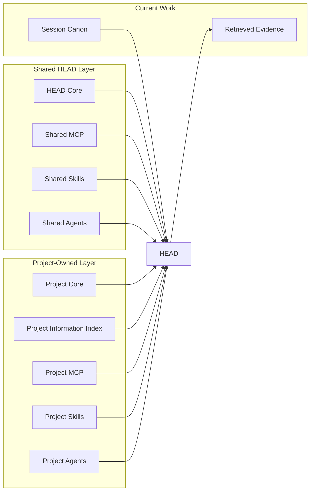

# HEAD Agent Core

[한국어](ko/README.md)

HEAD Agent Core is the project-independent layer of a HEAD system. It separates portable reasoning and execution infrastructure from the facts, policies, integrations, and specialists owned by an individual project.

This repository explains why each layer exists and links to its canonical implementation. It does not copy or publish a project's internal context.

> A small shared operating model, composed with a project-owned knowledge and capability layer.

## What It Provides

| Stable ownership | Deliberate context | Composable execution | Durable continuation |
| --- | --- | --- | --- |
| HEAD keeps the whole outcome while workers own bounded results. | Small always-on context points to deeper canonical sources. | MCPs provide interfaces, Skills provide procedures, and Agents provide outcome ownership. | Session canon preserves the user-HEAD agreement across interruption and compaction. |

## Composition Model



The shared layer defines behavior that survives a change of project. The project layer supplies local authority, knowledge routes, integrations, and specialists. The current session adds only the active work agreement; detailed evidence is retrieved when needed.

## Architecture

```text
HEAD
├─ Shared
│  ├─ Core
│  ├─ MCP
│  │  └─ agent-task
│  ├─ Skills
│  │  ├─ agent-reply
│  │  ├─ browser-query
│  │  ├─ delegate-task
│  │  ├─ restore-session
│  │  ├─ start-dev-work
│  │  └─ start-work
│  └─ Agents
│     ├─ Developer Core
│     └─ Validator Core
└─ Project Layer
   ├─ Core
   ├─ Additional Context
   ├─ MCP
   ├─ Skills
   └─ Agents
```

## Entry Paths

Choose the path that matches your purpose:

| Path | Start here | Use it for |
| --- | --- | --- |
| Learn | [Learn HEAD](learn/README.md) | The narrative course: why the model exists, how it evolved, and how its reasoning fits together. |
| Teach | [Teach HEAD](teaching/README.md) | Deliverable 20-, 60-, and 120-minute routes, canonical diagrams, and discussion prompts. |
| Reference | [Shared Core](head/README.md) | Current shared contracts and implementation-oriented architecture pages. |

## Reference

| Layer | Purpose |
| --- | --- |
| [Shared Core](head/README.md) | Stable HEAD ownership, reasoning, and context principles. |
| [Shared MCP](mcp/README.md) | Project-independent callable coordination interfaces. |
| [Shared Skills](skills/README.md) | Procedures that remain valid across projects. |
| [Shared Agents](agents/README.md) | Reusable worker roles and authority boundaries. |
| [Project Layer](projects/README.md) | Extension points for project-owned rules, knowledge, integrations, and specialists. |

## Context Flow

```text
shared principles
    + project rules
    + project information index
    + current session canon
              │
              ▼
            HEAD
              │
       retrieves only what
       the current outcome needs
              │
              ▼
    canonical evidence or a
    bounded specialist brief
```

This division prevents three common failures: loading an entire project into every prompt, letting a compact summary replace the original work agreement, and giving a worker broad history instead of one coherent outcome.

## Reading Model

Every level in this repository is a page. Category pages explain why the category exists and how it is separated from neighboring layers. Item pages explain the item's architectural role, delivery model, ownership boundary, and canonical source.

The documentation deliberately avoids duplicating instruction bodies or project context. Follow the canonical-source links only when the current task requires implementation detail.

## Follow A Path

| If you want to understand... | Start here | Continue to |
| --- | --- | --- |
| How HEAD owns and reasons about work | [Shared Core](head/README.md) | [Project Core](projects/core/README.md) |
| How HEAD finds knowledge without preloading it | [Additional Context](projects/context/README.md) | [Project Information Index](projects/context/project-index.md) |
| How capabilities are separated | [Shared MCP](mcp/README.md) | [Shared Skills](skills/README.md) and [Shared Agents](agents/README.md) |
| How a project extends HEAD | [Project Layer](projects/README.md) | Project [MCP](projects/mcp/README.md), [Skills](projects/skills/README.md), and [Agents](projects/agents/README.md) |

## Shared Or Project-Owned

An element is shared when its purpose, authority boundary, inputs, and success criteria remain valid after removing project names, paths, domain facts, credentials, and specialist routing. Everything else belongs to the project layer.

The shared repository therefore contains architecture and portable implementation. A project repository contains the project overlay and its actual context. The two are composed at runtime rather than copied into each other.
