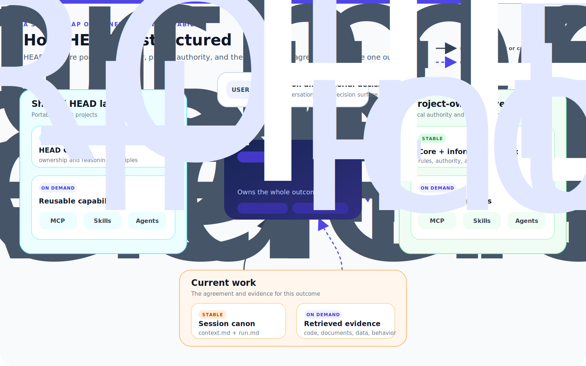

# HEAD Agent Core

[한국어](ko/README.md)

HEAD Agent Core is an operating model for long, multi-step AI work. A person keeps direction, one coordinating HEAD keeps the whole outcome, and bounded Agents produce focused results that are checked before the work expands again.

It is not an autonomous swarm and it is not a replacement for project judgment. It separates portable reasoning and execution infrastructure from the facts, policies, integrations, and specialists owned by each project.

> **New to HEAD? Start with [Learn HEAD](learn/README.md).**
>
> The learning path is an 11-chapter course. You do not need to read all of it before you can understand or use the model.

## Choose Your Route

| Time | Start here | What you will get |
| --- | --- | --- |
| **2 minutes** | Read this page | A visual map of who owns what and how HEAD builds context. |
| **20 minutes** | [20-Minute Introduction](teaching/20-minute-introduction.md) | The controlled-expansion loop, decision ownership, and evidence gates. |
| **Full course** | [Learn HEAD](learn/README.md) | The 11-chapter explanation of the problem, architecture, evolution, and trade-offs. |
| **As needed** | [Implementation Reference](head/README.md) | Current shared contracts, components, and project extension points. |

## Why HEAD Exists

An LLM can elaborate one clear step well. Problems grow when an unchecked output becomes the input to several more steps: omissions compound, assumptions change silently, and a confident summary can replace the original goal.

HEAD keeps that expansion controlled by separating three responsibilities:

- **The User** sets direction and owns material decisions.
- **HEAD** builds the work model, composes context, coordinates execution, verifies evidence, and integrates the result.
- **A bounded Agent** owns one coherent result within a defined boundary.

The user talks to HEAD, not to a web of independent workers. HEAD remains responsible for the whole outcome even when execution expands downward.

## Context Is The System

For project work, an LLM's effective world is the context assembled for it. Context determines what the model can see, which source it treats as authority, which decisions remain fixed, and what next action appears legitimate.

Every major HEAD mechanism is therefore a context-control choice:

- **Core** keeps stable ownership and reasoning principles present.
- **Project indexes** route HEAD to authority without dumping every source into the prompt.
- **Runtime canon** keeps the user's problem, goal, decisions, and current position outside a lossy summary when the work needs continuity.
- **Skills and MCP contracts** expose the relevant procedure or operation at the moment it is needed.
- **Bounded Agent briefs** turn whole-outcome context into the smallest complete context another owner needs.

If raw volume solved this problem, HEAD could hand the model every document and ask it to read. This architecture exists because context quality depends on authority, relevance, timing, and ownership rather than maximum quantity.

## How HEAD Is Structured

The shared layer contains behavior that should survive a change of project. The project layer supplies local authority, knowledge routes, integrations, and specialists. Runtime canon preserves the current user-HEAD agreement. Agents receive bounded ownership, not independent project authority.

## How HEAD Builds Context

Context is a governed working set, not everything the system can find. HEAD keeps stable authority small, retrieves detail when it can change the current outcome, and narrows the result again before assigning work. Context quality depends on authority, relevance, timing, and ownership rather than maximum volume.

## What This Repository Contains

| Path | Purpose |
| --- | --- |
| [Learn](learn/README.md) | A narrative course explaining why HEAD exists, how it evolved, and how the reasoning fits together. |
| [Teach](teaching/README.md) | Ready-made 20-, 60-, and 120-minute teaching routes, canonical diagrams, and discussion prompts. |
| [Shared Core](head/README.md) | Stable ownership, reasoning, context, and continuation principles. |
| [Shared MCP](mcp/README.md) | Project-independent callable interfaces. |
| [Shared Skills](skills/README.md) | Procedures loaded only when a matching task needs them. |
| [Shared Agents](agents/README.md) | Reusable bounded outcome owners and authority boundaries. |
| [Project Layer](projects/README.md) | Extension points for project-owned rules, knowledge, integrations, and specialists. |

The learning pages explain design intent. The reference pages describe current contracts. Neither branch copies a project's private context or full instruction bodies into this public repository.

## What The Model Provides

| Stable ownership | Deliberate context | Composable execution | Durable continuation |
| --- | --- | --- | --- |
| HEAD keeps the whole outcome while Agents own bounded results. | Small always-on context points to deeper canonical sources. | MCPs provide interfaces, Skills provide procedures, and Agents provide outcome ownership. | Session canon preserves the user-HEAD agreement across interruption and compaction. |

## Shared Or Project-Owned

An element is shared when its purpose, authority boundary, inputs, and success criteria remain valid after removing project names, paths, domain facts, credentials, and specialist routing. Everything else belongs to the project layer.

The shared repository contains portable architecture and implementation. A project repository contains the project overlay and its actual context. The two are composed at runtime rather than copied into each other.
