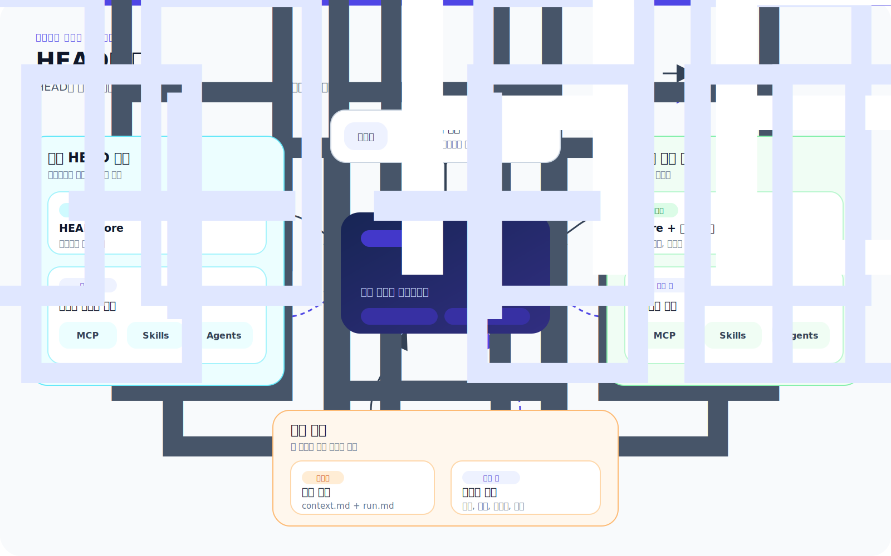

# HEAD Agent Core

[English](../README.md)

HEAD Agent Core는 길고 여러 단계로 이어지는 AI 작업을 위한 운영 모델입니다. 사람은 방향을 유지하고, 하나의 조정 역할인 HEAD는 전체 결과를 유지하며, 경계가 정해진 Agents는 집중된 결과를 만든 뒤 작업이 다시 확장되기 전에 검증받습니다.

이 모델은 자율 에이전트 군집이 아니며 프로젝트 판단을 대신하지도 않습니다. 프로젝트가 바뀌어도 유지되는 추론 및 실행 인프라와, 각 프로젝트가 소유해야 하는 사실, 정책, 통합, 전문 역할을 분리합니다.

> **HEAD가 처음이라면 [HEAD 학습](learn/README.md)에서 시작하세요.**
>
> 학습 경로는 11개 장으로 구성된 하나의 강의입니다. 모델을 이해하거나 사용하기 전에 전부 읽을 필요는 없습니다.

## 시간에 맞는 경로 선택

| 시간 | 여기서 시작 | 얻게 되는 것 |
| --- | --- | --- |
| **2분** | 이 페이지 읽기 | 누가 무엇을 소유하고 HEAD가 컨텍스트를 어떻게 구성하는지 보여 주는 시각적 지도입니다. |
| **20분** | [20분 소개](teaching/20-minute-introduction.md) | 통제된 확장 루프, 의사결정 소유권, 근거 게이트입니다. |
| **전체 강의** | [HEAD 학습](learn/README.md) | 문제, 아키텍처, 발전 과정, 트레이드오프를 설명하는 11개 장입니다. |
| **필요할 때** | [구현 참조 (영문)](../head/README.md) | 현재 공유 계약, 구성 요소, 프로젝트 확장 지점입니다. |

## HEAD가 필요한 이유

LLM은 명확한 한 단계를 잘 구체화할 수 있습니다. 하지만 검토하지 않은 결과가 여러 다음 단계의 입력이 되면 누락이 누적되고, 가정이 조용히 바뀌며, 그럴듯한 요약이 원래 목표를 대체할 수 있습니다.

HEAD는 세 가지 책임을 분리해 확장을 통제합니다.

- **사용자**는 방향을 정하고 중요한 결정을 소유합니다.
- **HEAD**는 작업 모델과 컨텍스트를 만들고, 실행을 조정하며, 근거를 검증하고, 결과를 통합합니다.
- **경계가 정해진 Agent**는 정해진 범위 안에서 하나의 일관된 결과를 소유합니다.

사용자는 독립된 여러 워커와 대화하지 않고 HEAD와 대화합니다. 실행이 아래로 확장되어도 HEAD는 전체 결과에 대한 책임을 유지합니다.

## 컨텍스트가 시스템을 만든다

프로젝트 작업에서 LLM이 실제로 보는 세계는 조립되어 들어온 컨텍스트입니다. 컨텍스트는 모델이 무엇을 볼 수 있는지, 어떤 출처를 권위로 취급하는지, 어떤 결정이 고정되어 있는지, 다음에 어떤 행동이 정당한지를 결정합니다.

따라서 HEAD의 주요 메커니즘은 모두 컨텍스트 제어를 위한 선택입니다.

- **Core**는 안정적인 소유권과 추론 원칙을 계속 제공합니다.
- **프로젝트 인덱스**는 모든 출처를 prompt에 쏟아 넣지 않고 HEAD를 권위 있는 정보로 안내합니다.
- **런타임 정본**은 연속성이 필요한 작업에서 사용자의 문제, 목표, 결정, 현재 위치를 손실이 있는 요약 밖에 유지합니다.
- **Skills와 MCP 계약**은 필요한 순간에 관련 절차나 작업만 노출합니다.
- **경계가 정해진 Agent 브리프**는 전체 결과의 컨텍스트를 다른 소유자에게 필요한 가장 작은 완전한 컨텍스트로 바꿉니다.

원시 분량만으로 문제가 해결된다면 모든 문서를 모델에 주고 읽으라고 하면 됩니다. 이 아키텍처가 존재하는 이유는 컨텍스트 품질이 최대 분량이 아니라 권위, 관련성, 시점, 소유권에 달려 있기 때문입니다.

## HEAD의 구조

공유 계층에는 프로젝트가 바뀌어도 유지되어야 하는 행동이 들어 있습니다. 프로젝트 계층은 로컬 권위 출처, 지식 경로, 통합, 전문 역할을 제공합니다. 런타임 정본은 현재 사용자-HEAD 합의를 보존합니다. Agents는 경계가 정해진 소유권을 받지만 프로젝트 방향을 독립적으로 결정하지 않습니다.

## HEAD의 컨텍스트 구성

컨텍스트는 시스템이 찾을 수 있는 모든 정보가 아니라 통제된 작업 집합입니다. HEAD는 안정적인 권위 정보를 작게 유지하고, 현재 결과를 바꿀 수 있는 세부 정보만 검색하며, 작업을 맡기기 전에 다시 좁힙니다. 컨텍스트 품질은 최대 분량이 아니라 권위, 관련성, 시점, 소유권에 달려 있습니다.

## 이 저장소에 있는 것

| 경로 | 목적 |
| --- | --- |
| [학습](learn/README.md) | HEAD가 존재하는 이유, 발전 과정, 추론 구조를 설명하는 서술형 강의입니다. |
| [교육](teaching/README.md) | 바로 사용할 수 있는 20분, 60분, 120분 교육 경로, 정본 다이어그램, 토론 질문입니다. |
| [공유 Core (영문)](../head/README.md) | 안정적인 소유권, 추론, 컨텍스트, 연속성 원칙입니다. |
| [공유 MCP (영문)](../mcp/README.md) | 프로젝트 독립적인 호출 가능 인터페이스입니다. |
| [공유 Skills (영문)](../skills/README.md) | 맞는 작업이 있을 때만 로드하는 절차입니다. |
| [공유 Agents (영문)](../agents/README.md) | 재사용 가능한 경계 있는 결과 소유자와 권한 경계입니다. |
| [프로젝트 계층 (영문)](../projects/README.md) | 프로젝트 소유 규칙, 지식, 통합, 전문 역할을 위한 확장 지점입니다. |

학습 페이지는 설계 의도를 설명하고 참조 페이지는 현재 계약을 설명합니다. 어느 쪽도 프로젝트의 비공개 컨텍스트나 전체 지시문 본문을 이 공개 저장소에 복사하지 않습니다.

## 모델이 제공하는 것

| 안정적인 소유권 | 의도적으로 구성한 컨텍스트 | 조합 가능한 실행 | 오래 유지되는 연속성 |
| --- | --- | --- | --- |
| HEAD는 전체 결과를 유지하고, Agents는 경계가 정해진 결과를 소유합니다. | 작고 항상 로드되는 컨텍스트는 더 깊은 정본 출처를 가리킵니다. | MCP는 인터페이스를, Skills는 절차를, Agents는 결과 소유권을 제공합니다. | 세션 정본은 중단 및 압축을 거쳐 사용자-HEAD 합의를 보존합니다. |

## 공유 또는 프로젝트 소유

요소의 목적, 권한 경계, 입력, 성공 기준이 프로젝트 이름, 경로, 도메인 사실, 자격 증명, 전문 역할 라우팅을 제거한 뒤에도 유효하다면 그 요소는 공유됩니다. 그 밖의 모든 것은 프로젝트 계층에 속합니다.

공유 저장소에는 이식 가능한 아키텍처와 구현이 들어 있습니다. 프로젝트 저장소에는 프로젝트 오버레이와 실제 컨텍스트가 들어 있습니다. 두 저장소는 서로 복사하는 대신 런타임에 조합됩니다.
