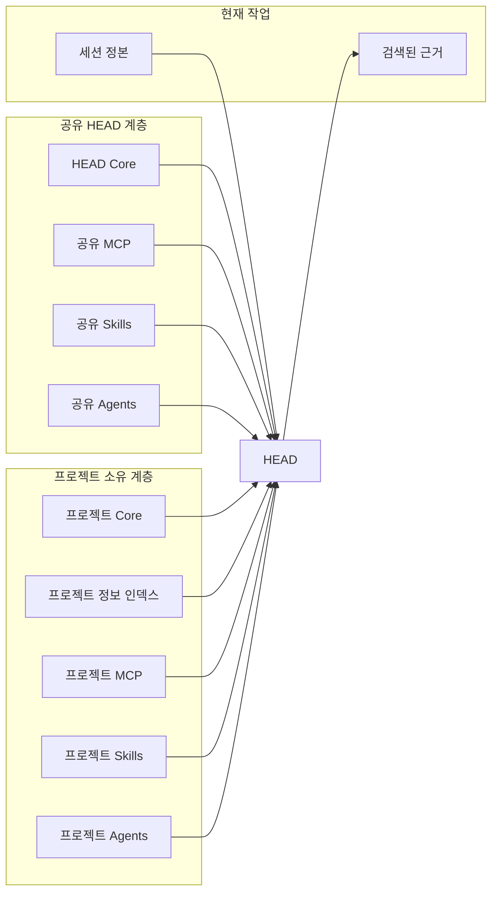

# HEAD Agent Core

[English](../README.md)

HEAD Agent Core는 HEAD 시스템의 프로젝트 독립 계층입니다. 이 계층은 이식 가능한 추론 및 실행 인프라를 개별 프로젝트가 소유하는 사실, 정책, 통합, 전문 역할과 분리합니다.

이 저장소는 각 계층이 존재하는 이유를 설명하고 정본 구현으로 연결합니다. 프로젝트의 내부 컨텍스트를 복사하거나 공개하지 않습니다.

> 프로젝트 소유의 지식 및 역량 계층과 조합되는, 작고 공유되는 운영 모델.

## 제공하는 것

| 안정적인 소유권 | 의도적으로 구성한 컨텍스트 | 조합 가능한 실행 | 오래 유지되는 연속성 |
| --- | --- | --- | --- |
| HEAD는 전체 결과를 유지하고, 에이전트는 경계가 정해진 결과를 소유합니다. | 작고 항상 로드되는 컨텍스트는 더 깊은 정본 출처를 가리킵니다. | MCP는 인터페이스를, Skills는 절차를, Agents는 결과 소유권을 제공합니다. | 세션 정본은 중단 및 압축을 거쳐 사용자-HEAD 합의를 보존합니다. |

## 조합 모델



공유 계층은 프로젝트가 바뀌어도 유지되는 행동을 정의합니다. 프로젝트 계층은 로컬 권위 출처, 지식 경로, 통합, 전문 역할을 제공합니다. 현재 세션은 활성 작업 합의만 더하며, 상세 근거는 필요할 때 검색합니다.

## 아키텍처

```text
HEAD
├─ 공유
│  ├─ Core
│  ├─ MCP
│  │  └─ agent-task
│  ├─ Skills
│  │  ├─ agent-reply
│  │  ├─ browser-query
│  │  ├─ delegate-task
│  │  ├─ restore-session
│  │  ├─ start-dev-work
│  │  └─ start-work
│  └─ Agents
│     ├─ 개발자 Core
│     └─ 검증자 Core
└─ 프로젝트 계층
   ├─ Core
   ├─ 추가 컨텍스트
   ├─ MCP
   ├─ Skills
   └─ Agents
```

## 시작 경로

목적에 맞는 경로를 선택하세요.

| 경로 | 여기서 시작 | 용도 |
| --- | --- | --- |
| 학습 | [HEAD 학습](learn/README.md) | 모델이 존재하는 이유, 어떻게 발전했는지, 추론이 어떻게 맞물리는지를 다루는 서술형 과정입니다. |
| 교육 | [HEAD 교육](teaching/README.md) | 제공 가능한 20분, 60분, 120분 경로, 정본 다이어그램, 토론 질문입니다. |
| 참조 | [공유 Core (영문)](../head/README.md) | 현재 공유 계약과 구현 지향 아키텍처 페이지입니다. |

## 참조

| 계층 | 목적 |
| --- | --- |
| [공유 Core (영문)](../head/README.md) | 안정적인 HEAD 소유권, 추론, 컨텍스트 원칙입니다. |
| [공유 MCP (영문)](../mcp/README.md) | 프로젝트 독립적인 호출 가능 조정 인터페이스입니다. |
| [공유 Skills (영문)](../skills/README.md) | 프로젝트 전반에서 유효한 절차입니다. |
| [공유 Agents (영문)](../agents/README.md) | 재사용 가능한 에이전트 역할과 권한 경계입니다. |
| [프로젝트 계층 (영문)](../projects/README.md) | 프로젝트 소유 규칙, 지식, 통합, 전문 역할을 위한 확장 지점입니다. |

## 컨텍스트 흐름

```text
공유 원칙
    + 프로젝트 규칙
    + 프로젝트 정보 인덱스
    + 현재 세션 정본
              │
              ▼
            HEAD
              │
       현재 결과에 필요한 것만
       검색함
              │
              ▼
    정본 근거 또는
    경계가 정해진 전문 역할 브리프
```

이 분리는 세 가지 흔한 실패를 막습니다. 모든 프롬프트에 프로젝트 전체를 로드하는 것, 압축된 요약이 원래 작업 합의를 대체하게 하는 것, 하나의 일관된 결과 대신 광범위한 이력을 에이전트에게 주는 것입니다.

## 읽기 모델

이 저장소의 모든 수준은 페이지입니다. 범주 페이지는 범주가 존재하는 이유와 인접 계층과 어떻게 분리되는지를 설명합니다. 항목 페이지는 항목의 아키텍처 역할, 제공 모델, 소유권 경계, 정본 출처를 설명합니다.

문서는 지시문 본문이나 프로젝트 컨텍스트를 의도적으로 중복하지 않습니다. 현재 작업에 구현 세부 사항이 필요할 때만 정본 출처 링크를 따르세요.

## 경로 따라가기

| 이해하려는 내용 | 여기서 시작 | 계속 읽기 |
| --- | --- | --- |
| HEAD가 작업을 소유하고 추론하는 방식 | [공유 Core (영문)](../head/README.md) | [프로젝트 Core (영문)](../projects/core/README.md) |
| 사전 로드 없이 HEAD가 지식을 찾는 방식 | [추가 컨텍스트 (영문)](../projects/context/README.md) | [프로젝트 정보 인덱스 (영문)](../projects/context/project-index.md) |
| 역량이 분리되는 방식 | [공유 MCP (영문)](../mcp/README.md) | [공유 Skills (영문)](../skills/README.md) 및 [공유 Agents (영문)](../agents/README.md) |
| 프로젝트가 HEAD를 확장하는 방식 | [프로젝트 계층 (영문)](../projects/README.md) | 프로젝트 [MCP (영문)](../projects/mcp/README.md), [Skills (영문)](../projects/skills/README.md), [Agents (영문)](../projects/agents/README.md) |

## 공유 또는 프로젝트 소유

요소의 목적, 권한 경계, 입력, 성공 기준이 프로젝트 이름, 경로, 도메인 사실, 자격 증명, 전문 역할 라우팅을 제거한 뒤에도 유효하다면 그 요소는 공유됩니다. 그 밖의 모든 것은 프로젝트 계층에 속합니다.

따라서 공유 저장소에는 아키텍처와 이식 가능한 구현이 들어 있습니다. 프로젝트 저장소에는 프로젝트 오버레이와 실제 컨텍스트가 들어 있습니다. 두 저장소는 서로 복사하는 대신 런타임에 조합됩니다.
