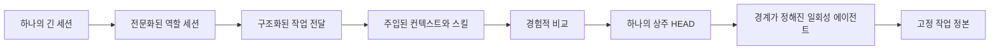

# 기원: 시스템은 어떻게 성장했는가

[HEAD Agent Core (영문)](../../../README.md) / [학습 과정 (영문)](../../../learn/README.md) / 기원

## 학습 목표

어떤 실무 실패가 단일 LLM 워크플로를 전문 역할, 오케스트레이션, 선별적 컨텍스트, 경계가 정해진 에이전트, 외부 작업 정본을 향해 나아가게 했는지 이해한다.

## 핵심 주장

현재 시스템은 한 번에 설계되지 않았다. 각 계층은 관찰된 실패에 대한 대응으로 시작되었다. 어떤 대응은 효과가 있었고, 어떤 대응은 지나치게 커졌으며, 몇몇은 조정 비용이 가치보다 커지자 나중에 제거되었다.

## 장 구성

1. [하나의 세션에서 여러 역할로](from-one-session-to-many-roles.md)는 초기의 컨텍스트, 전문화, 병렬 처리 문제를 설명한다.
2. [계속해서 무엇이 고장 났는가](what-kept-breaking.md)는 점점 늘어난 장치의 배경이 된 반복적인 운영 실패를 따라간다.
3. [실패한 설계](failed-designs.md)는 한 가지 국소 문제를 해결했지만 새로운 시스템 차원의 비용을 만든 메커니즘을 살펴본다.
4. [진화 연표](evolution-timeline.md)는 최초의 분리부터 현재 모델까지의 경로를 재구성한다.

## 이 역사를 읽는 법

초기 시스템은 현재 시스템보다 더 많은 에이전트, 더 많은 지속 상태, 더 엄격한 명령 형식, 더 많은 복구 로직을 사용했다. 역사에 등장한다는 이유만으로 이런 메커니즘을 그대로 따라 해서는 안 된다. 그 가치는 설명에 있다. 무엇이 실패했고, 무엇이 살아남았으며, 왜 단순화가 복잡성보다 먼저가 아니라 나중에 이루어졌는지를 보여 준다.

현재 참조 계약은 여기서 설명하는 역사적 설계가 아니라 [공유 코어 (영문)](../../../head/README.md)에서 시작한다.

다음: [하나의 세션에서 여러 역할로](from-one-session-to-many-roles.md)
