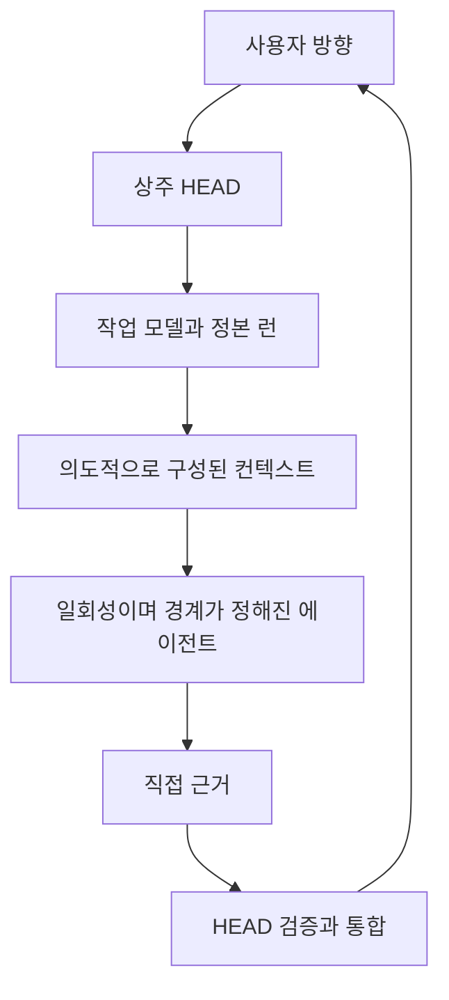

# 진화 연표

[HEAD Agent Core (영문)](../../../README.md) / [학습 과정 (영문)](../../../learn/README.md) / [기원](README.md) / 진화 연표

## 학습 목표

현재 아키텍처를 고정된 청사진이 아니라 근거에 따른 개정의 결과로 바라본다.

## 1단계: 하나의 대화가 모든 일을 했다

조사, 계획, 구현, 검토, 문서화가 점점 커지는 하나의 컨텍스트를 공유했다. 초기 설정은 최소화되었지만 역할이 뒤섞였고, 독립적인 작업도 순차 처리되었으며, 긴 작업은 취약해졌다.

**설계 대응:** 전문 역할을 분리한다.

## 2단계: 장기 실행 역할 에이전트

별도 세션들이 조사, 계획, 구현, 검증을 맡았다. HEAD 조정자가 단계를 배정하고 산출물을 결합했다.

**개선된 점:** 컨텍스트 분리, 영역 집중, 병렬 작업, 단계 단위 재시도.

**다음에 나타난 것:** 전달 오류, 서로 달라진 컨텍스트, 에이전트 모니터링, 복구의 복잡성, 늘어나는 에이전트 목록.

## 3단계: 구조화된 작업 제어

작업 제어 서비스가 불안정한 자유 형식 터미널 명령을 대체했다. 계획, 작업 패키지, 단계 파일, 상태 기록, 명령 검증, 단계 게이트를 통해 위임을 검사할 수 있게 되었다.

**개선된 점:** 명령 전달, 진행 상황 가시성, 재현성, 자동 검증 훅.

**다음에 나타난 것:** 스키마를 위한 형식 절차, 메커니즘 우선 계획, 모든 작업을 같은 순서로 표현해야 한다는 압박.

## 4단계: 명시적 컨텍스트 계층과 스킬

안정적인 프로젝트 컨텍스트, 세션 컨텍스트, 역할 지식을 자동으로 주입했다. 상세한 워크플로는 항상 불러오는 프롬프트에서 필요할 때만 사용하는 스킬로 옮겼다.

**개선된 점:** 더 작은 역할 프롬프트, 더 나은 검색 포인터, 반복되는 절차 문구 감소.

**다음에 나타난 것:** 더 풍부한 컨텍스트와 더 많은 도구가 자동으로 더 나은 작업이나 더 저렴한 작업을 만든다는 믿음.

## 5단계: 경험적 재구성

도구가 풍부한 HEAD 경로와 더 단순한 에이전트를 비교하자 몇 가지 가정이 흔들렸다.

시스템이 코드를 더 저렴하게 읽는 방식으로 일관되게 우위에 선 것은 아니었다. 최신 모델은 정교한 컨텍스트 인프라가 없어도 로컬 코드베이스를 효과적으로 검색할 때가 많았다. 풍부한 도구가 광범위한 조사를 유발하면 비용도 더 많이 들었다.

오래 남는 장점은 다른 곳에서 나타났다.

- 코드베이스 밖의 근거
- 사용자 언어와 구현 근거의 연결
- 문서와 현재 동작 사이의 충돌 감지
- 실시간 출처 또는 1차 출처에 비추어 주장을 검증하는 일
- 결정 경계와 검토 게이트의 보존

**설계 대응:** 검색 기술을 주인공처럼 취급하지 않는다. 근거 선택과 검증 행동을 HEAD의 책임으로 다룬다.

## 6단계: 운영 단순화

도구 범위가 줄었다. 읽기 중심 워크플로는 필요할 때 불러오는 절차 뒤로 이동했다. 에이전트 목록이 축소되었다. 상주 에이전트 체계는 일회성 작업 방식으로 바뀌었다. 세부 금지 사항은 더 포괄적인 소유권 원칙과 추론 원칙으로 대체되었다.

**개선된 점:** 더 적은 조정 부담, 더 명확한 역할 경계, 더 적은 낡은 지침.

**다음에 나타난 것:** 압축이나 생성된 진행 상황이 원래 합의를 밀어내면 긴 작업은 여전히 훼손될 수 있었다.

## 7단계: 고정 작업 정본

복구 모델은 고정된 세션 파일 두 개로 줄었다. 하나는 안정적인 세션 정체성이고, 다른 하나는 전체 사용자-HEAD 작업 합의다. 진행 상황과 이력은 검색할 수 있게 남았지만 작업을 다시 정의할 권한은 잃었다.

**현재 모델:**

## 개념적으로 달라진 점

| 이전의 강조점 | 현재의 강조점 |
| --- | --- |
| 더 많은 전문 에이전트 | 일관된 결과 소유권을 가진 더 적은 에이전트 |
| 더 상세한 명령 제약 | 생성적 원칙과 관찰 가능한 결과 계약 |
| 더 많은 자동 로드 컨텍스트 | 작은 인덱스와 의도적인 검색 |
| 생성된 현재 상태를 통한 복구 | 고정된 사용자-HEAD 합의로부터의 복구 |
| 최대 자동화 | 검증 게이트를 둔 통제된 확장 |
| 도구의 가용성 | 근거 선택과 올바른 도구 사용 |

## 근거의 경계

위 순서는 역사적 저장소 문서, 커밋, 보관된 브리핑 스크립트, 런타임 테스트, 기록된 운영 실패가 뒷받침한다. 시스템이 제어 평면, 경계가 정해진 컨텍스트, 최소 권한 개념으로 수렴했다는 해석은 회고적인 것이며 이후 장에서 전개한다.

## 핵심 정리

현재 아키텍처는 이전의 여러 형태보다 작지만 구조가 덜 갖춰진 것은 아니다. 에이전트 수와 작업 장치가 아니라 소유권, 컨텍스트 선택, 정본, 검증에 구조를 집중한다.

다음: [LLM 문제 모델](../02-llm-problem/README.md)

출처 분류: 역사적 기록과 현재 아키텍처 계약.
