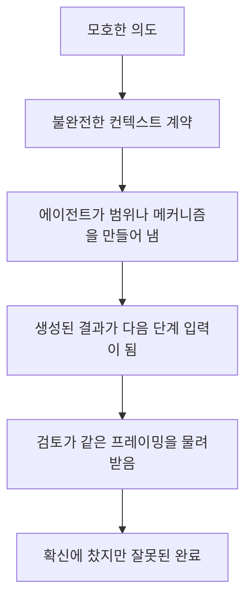

# 계속해서 무엇이 고장 났는가

[HEAD Agent Core](../../README.md) / [학습](../README.md) / [기원](README.md) / 계속해서 무엇이 고장 났는가

## 학습 목표

전달, 컨텍스트, 복구, 검증 장치가 시스템에 계속 쌓이게 만든 반복적인 실패 유형을 알아본다.

## 핵심 주장

오케스트레이션이 처음부터 목표였기 때문에 시스템이 복잡해진 것은 아니다. 장기 실행 작업이 의도, 컨텍스트, 실행, 복구 사이의 경계에서 반복적으로 실패했기 때문에 복잡해졌다.

## 1. 명령이 의도대로 도착하지 않았다

최초의 에이전트 명령은 터미널 자동화를 통해 전송되었다. 긴 지침은 따옴표 처리, 이스케이프, 줄바꿈, 창 선택의 경계를 통과했다. 명령이 잘리거나, 셸에 의해 해석되거나, 잘못된 대상에게 전달되거나, 안전하게 실행하기에 정보가 부족한 상태로 받아들여질 수 있었다.

이에 대한 대응은 구조화된 작업 전달이었다. 명령은 검증과 명시적 목적지를 갖춘 영속 산출물이 되었다. 이것이 공유 작업 제어 인터페이스의 시작이었다.

교훈은 터미널의 신뢰성보다 더 큰 것이었다.

> 위임 경계에는 자연어 의도가 전달 과정에서도 그대로 보존되었다는 가정이 아니라, 관찰 가능한 계약이 필요하다.

## 2. 포괄적인 지침은 포괄적인 탐색을 낳았다

에이전트가 "이것을 분석해라" 또는 "문제를 고쳐라"라는 지시를 받으면 관련 범위를 스스로 만들어 내야 했다. 무엇이 중요한지 결정하기 전에 큰 파일을 읽고, 지나치게 큰 도구 출력을 수집하고, 무관한 영역을 탐색하는 일이 잦았다.

이는 컨텍스트를 소모하고 최종 추론을 감사하기 어렵게 만들었다. 이에 대한 대응으로 작업 패키지를 갈수록 상세하게 만들고, 출력을 명시하고, 엄격한 명령 스키마를 도입했다.

일관성은 좋아졌지만, 지나치게 상세한 지침은 나중에 그 자체로 문제가 되었다. HEAD가 의도한 결과를 정의하는 대신 검증되지 않은 구현을 실수로 지시할 수 있었기 때문이다.

## 3. 긴 작업이 형태를 잃었다

큰 작업은 여러 단계로 나뉘었다. 초기 단계는 의도한 방법론을 따르더라도, 이후 단계는 컨텍스트 압축이나 반복적인 인계 뒤에 방향을 잃을 수 있었다. 원래 결과가 바뀌었는데도 완료 단계 목록은 정상으로 보일 수 있었다.

시스템은 진행 파일, 작업 상태, 복구 명령, 활성 포인터, 단계 검증을 추가했다. 각 메커니즘은 하나의 질문에 답하려 했다. "우리는 정확히 무엇을 하고 있으며, 다음에는 무엇을 해야 하는가?"

결국 얻은 교훈은 현재 위치만으로는 충분하지 않다는 것이었다. 복구에는 원래의 문제, 목표, 범위, 결정, 성공 조건도 필요하다.

## 4. 컨텍스트 압축이 실질적인 작업을 바꾸었다

압축은 긴 대화를 손실이 있는 형태로 표현한다. 초기 설계에서는 생성된 복구 메시지나 현재 상태 파일에 충분한 권위가 있다고 취급했다. 요약이 적절한 세부 사항을 보존했을 때는 효과가 있었지만, 그러지 못했을 때는 심각하게 실패했다.

위험한 실패 양상이 나타났다.

```text
부분 결과
    -> 전체 완료로 압축됨
    -> 새로운 작업 상태로 불러옴
    -> 축소된 범위를 기준으로 검증함
    -> 올바르다고 보고함
```

나중의 검증기는 내부적으로 일관되면서도 잘못된 목표를 검증할 수 있었다. 단순히 정보가 빠진 것이 아니었다. 손실을 거친 파생물이 사용자-HEAD 합의를 밀어내고 그 자리를 차지한 것이다.

## 5. 도구가 많다고 더 나은 작업이 보장되지는 않았다

검색 시스템, 브라우저 도구, 데이터베이스, 전문 인터페이스를 추가하면 모델이 할 수 있는 일은 늘었다. 그렇다고 모델이 올바른 도구를 선택하거나, 충분히 깊이 사용하거나, 직접 근거와 편리한 문서를 구분한다고 보장되지는 않았다.

운영상의 비교에서는 더 단순한 에이전트가 코드 내부 작업을 더 빠르게 해결하는 경우도 있었다. 풍부한 HEAD 구성은 코드 밖의 근거, 출처 간 검증, 사용자 언어의 해석, 오래 유지할 결정이 필요한 작업에서 가장 가치가 컸다.

이에 따라 질문은 "도구를 몇 개나 제공할 수 있는가?"에서 "어떤 역량이 이 결과를 바꾸며, 누가 그 사용을 소유해야 하는가?"로 바뀌었다.

## 6. 검토가 같은 오류를 반복할 수 있었다

검토에 다른 이름표가 붙었다고 해서 독립적인 것은 아니다. 검토자가 똑같이 축소된 범위, 오래된 가정, 근거 없는 진단을 물려받으면 같은 실수를 확신에 차서 승인할 수 있다.

따라서 시스템은 여러 관심사를 분리했다.

- 에이전트는 자신이 맡은 국소 결과를 검증한다.
- HEAD는 그 결과가 원래 결과에 어떻게 결합되는지 검증한다.
- 별도의 판단이 결과를 실질적으로 바꿀 수 있을 때만 독립 검증자를 추가한다.
- 사용자는 중요한 방향과 위험에 대한 최종 권한을 유지한다.

## 실패 양상



현재 설계는 사용자가 소유한 결정, HEAD가 소유한 작업 모델링, 경계가 정해진 에이전트 소유권, 직접 근거, 정본에 따른 복구를 통해 이 연쇄를 여러 지점에서 끊는다.

## 핵심 정리

대부분의 실패는 하나의 모델 응답 내부가 아니라 전환 지점에서 일어났다. 따라서 신뢰할 수 있는 오케스트레이션은 지능을 더하는 일보다 경계를 지날 때 의미를 보존하는 일에 더 크게 좌우된다.

다음: [실패한 설계](failed-designs.md)

출처 분류: 역사적 저장소 기록, 보관된 브리핑 자료, 런타임 사고, 일반화된 실패 사례.
