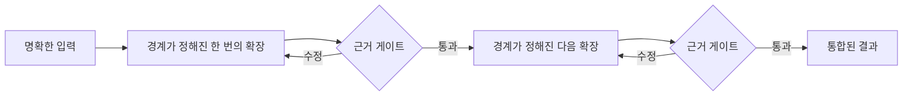

# LLM 문제 모델

[HEAD Agent Core](../../README.md) / [학습](../README.md) / LLM 문제 모델

## 학습 목표

통제된 확장, 선별적 컨텍스트, 명시적 소유권, 검증 게이트의 근거가 되는 LLM 행동에 관한 운영 가정을 이해한다.

## 핵심 주장

이 아키텍처는 LLM이 복잡한 작업을 수행할 수 없다고 가정하지 않는다. 생성된 작업이 여러 변환을 거치는 동안 컨텍스트, 권위, 검증 상태가 보존되지 않으면 위험해진다고 가정한다.

## 다섯 가지 핵심 개념

1. [컨텍스트는 기억이 아니다](context-is-not-memory.md)는 대본을 다시 읽는 배우 비유와 그 한계를 소개한다.
2. [한 단계 확장 규칙](the-one-step-expansion-rule.md)은 경계가 정해진 구체화가 유용할 수 있는 반면, 통제되지 않는 재귀적 확장이 위험한 이유를 설명한다.
3. [오류는 하류에서 누적된다](error-compounds-downstream.md)는 누락과 가정이 어떻게 물려받은 전제가 되는지 보여 준다.
4. [확장 전 검증](verification-before-expansion.md)은 생성 단계 사이의 근거 게이트를 정의한다.
5. [컨텍스트가 많다고 지능이 높아지는 것은 아니다](why-more-context-is-not-more-intelligence.md)는 컨텍스트의 양을 권위, 관련성, 시점, 소유권으로 대체한다.

## 모델의 지위

이는 언어 모델에 관한 완전한 과학 이론이 아니라 운영 모델이다. 시스템에 영향을 준 반복 가능한 실패 양상을 요약한다. 이후 장에서는 그 양상을 계층적 계획, 정보 경계, 최소 권한, 직무 분리라는 확립된 개념과 연결한다.

다음: [컨텍스트는 기억이 아니다](context-is-not-memory.md)
