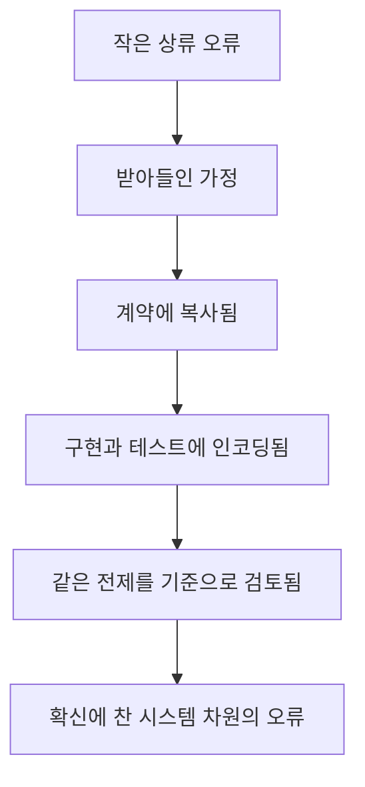

# 오류는 하류에서 누적된다

[HEAD Agent Core](../../README.md) / [학습](../README.md) / [LLM 문제 모델](README.md) / 오류는 하류에서 누적된다

## 학습 목표

워크플로 상류의 작은 미검증 오류가 하류의 눈에 보이는 구현 결함보다 더 위험할 수 있는 이유를 살펴본다.

## 상류 오류의 네 가지 형태

### 누락

요구 사항, 예외, 사용자 결정이 다음 단계로 전달되는 표현에서 빠진다.

### 추측

모델이 빠진 사실을 그럴듯한 가정으로 채우고 검증되지 않았다고 표시하지 않는다.

### 범위 표류

부분 결과, 편리한 하위 문제, 최근 산출물이 의도한 전체 결과를 대체한다.

### 권위 표류

요약, 에이전트 보고, 오래된 문서, 런타임 상태가 사용자나 정본 출처를 덮어쓸 수 있는 것처럼 취급된다.

## 누적이 일어나는 방식

일반적인 소프트웨어 워크플로를 생각해 보자.

```text
사용자가 어떤 동작을 요청함
    -> 계획에서 한 가지 경계 사례가 빠짐
    -> 명세는 누락을 의도적인 것으로 취급함
    -> 구현에는 그 사례를 위한 분기가 없음
    -> 같은 명세에서 테스트가 생성됨
    -> 검토는 구현이 명세와 일치한다고 확인함
```

모든 하류 산출물은 내부적으로 일관된다. 시스템이 더 정확해진 것이 아니라 원래의 누락을 발견하기 더 어렵게 만든 것이다.



## 검토만으로 충분하지 않은 이유

검토자는 훼손된 목표를 놓치면서도 국소 결함은 찾아낼 수 있다. 검토 질문이 "이 산출물은 이 명세를 충족하는가?"이고 명세에서 이미 사용자의 요구 사항이 사라졌다면, 흠잡을 데 없는 검토가 잘못된 결론을 오히려 강화할 수 있다.

독립 검토는 최신 파생 산출물만이 아니라 작업을 지배하는 요구 사항과 1차 근거에 접근할 수 있을 때만 그 이름에 걸맞다.

## 늦은 발견의 비용

구현 결함에는 코드 변경 하나가 필요할 수 있다. 상류의 프레이밍 결함은 계획, 인터페이스, 테스트, 문서, 릴리스 결정을 한꺼번에 무효로 만들 수 있다.

이것이 HEAD가 모든 국소 행동보다 결정 경계에 더 주의를 기울이는 이유다. 목표는 모든 실수를 없애는 것이 아니다. 영향력이 큰 실수가 이후 작업의 기반이 되기 전에 찾아내는 것이다.

## 소유권을 통한 오류 억제

사용자-HEAD-에이전트 위계는 확인되지 않은 결론이 이동할 수 있는 범위를 제한한다.

| 계층 | 소유하는 것 | 위임하거나 상위로 전달하는 것 |
| --- | --- | --- |
| 사용자 | 중요한 방향, 정책, 위험, 최종 우선순위 | 보통 계획과 국소 실행 선택을 HEAD에 위임 |
| HEAD | 작업 모델, 컨텍스트 선택, 순서 결정, 통합 | 새로운 중요한 방향을 사용자에게 전달 |
| 에이전트 | 하나의 결과 안에서 이루어지는 국소 실행 선택 | 상위 범위, 정책, 성공 정의에 관한 질문을 HEAD에 반환 |

에이전트가 상위 프레이밍에 이의를 제기하는 근거를 발견하면, 충돌을 숨기거나 정책을 만들어 내서는 안 된다. HEAD가 작업 모델을 갱신하거나 사용자 결정을 요청할 수 있도록 근거를 반환하는 것이 올바른 행동이다.

## 일반화된 실패

에이전트가 코드에서 실제 결함을 발견하고 보고된 문제의 원인으로 제시했다. 진단은 그럴듯했고 기술적으로도 타당했다. 나중에 직접 근거를 확인하자 영향을 받은 사례는 그 결함을 전혀 거치지 않았다. 에이전트는 사용자의 문제가 아니라 그 근처의 문제를 해결한 것이다.

교훈은 "에이전트는 절대 조사해서는 안 된다"가 아니었다. 국소 진단을 실제 사례를 식별하는 근거와 통합해야 한다는 것이었다.

## 핵심 정리

가장 위험한 오류는 잘못된 코드 한 줄이 아닐 때가 많다. 올바르게 보이는 여러 단계가 물려받는, 검증되지 않은 전제다.

다음: [확장 전 검증](verification-before-expansion.md)

출처 분류: 일반화된 운영 실패와 현재 권한 모델.
