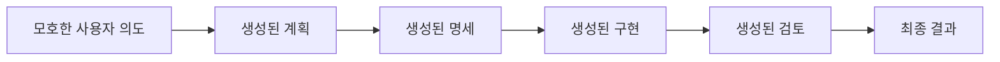
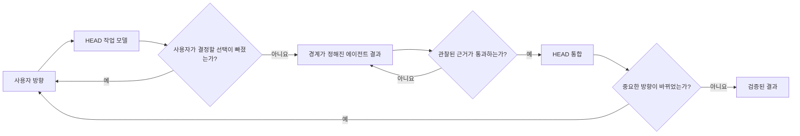

# 한 단계 확장 규칙

[HEAD Agent Core](../../README.md) / [학습](../README.md) / [LLM 문제 모델](README.md) / 한 단계 확장 규칙

## 학습 목표

HEAD가 생성을 모호한 의도에서 최종 결과까지 이어지는 하나의 자율적 연쇄가 아니라, 경계가 정해지고 검증된 확장의 연속으로 취급하는 이유를 이해한다.

## 핵심 주장

LLM은 명확한 하나의 입력을 다음의 유용한 표현으로 구체화하는 데 흔히 효과적이다. 그렇게 생성된 표현을 검증하지 않고 받아들여 여러 차례 추가 변환의 전제로 삼으면 위험이 커진다.

이를 한 단계 확장 규칙으로 요약한다.

> 일관된 한 단계를 확장하고, 무엇이 바뀌었는지 검증한 뒤에야 그 결과를 다음 단계의 입력으로 사용한다.

이는 모든 작업에 도구 호출이 하나만 있어야 한다거나 모델이 여러 내부 추론 단계를 수행할 수 없다는 주장이 아니라 운영 규칙이다. "한 단계"란 독립적으로 관찰 가능한 하나의 결과를 가진 하나의 소유권 경계를 뜻한다.

## 무엇이 확장에 해당하는가

확장은 작업의 수준이나 구체성을 바꾼다.

```text
방향
    -> 작업 모델
    -> 경계가 정해진 작업 계약
    -> 구현 또는 산출물
    -> 통합된 결과
```

각 화살표는 이전에는 완전히 존재하지 않았던 세부 사항을 도입한다. 새 세부 사항은 올바를 수도 있지만 누락, 추측, 다른 소유자에게 속한 선택을 포함할 수도 있다.

## 하위 수준 작업이 강할 수 있는 이유

이 규칙은 LLM이 구현에 약하다는 믿음에 근거하지 않는다. 에이전트는 다음을 받으면 매우 효과적으로 작업할 수 있다.

- 만들어야 할 명확한 결과
- 관련된 출발 근거
- 확정된 결정과 경계
- 일반적인 국소 선택에 대한 권한
- 완료를 직접 검증할 방법

이렇게 경계가 정해진 공간 안에서 에이전트는 HEAD가 모든 줄을 지시하지 않아도 진단하고, 구현하고, 테스트할 수 있다.

## 품질이 떨어지는 지점

시스템이 생성된 가정을 눈에 띄지 않게 이어 붙일 때 문제가 생긴다.



어떤 단계도 이전 출력을 사용자, 1차 근거, 관찰된 동작에 비추어 확인하지 않으면 연쇄는 자기참조적이 된다. 계획 속의 그럴듯한 가정이 명세에서는 요구 사항이 되고, 구현에서는 인터페이스가 되며, 검토에서는 통과 조건이 된다.

## 통제된 확장

HEAD는 소유권과 근거 게이트를 삽입한다.



게이트가 항상 사람의 회의를 뜻하는 것은 아니다. 테스트, diff, 스크린숏, 쿼리, 스키마 검증, 출처 비교, 직접 검사가 될 수 있다. 중요한 것은 다음 확장이 검증되지 않은 이야기가 아니라 확인된 결과를 사용한다는 점이다.

## 작은 작업은 여전히 작게 유지한다

국소적이고 되돌릴 수 있으며 즉시 검증 가능한 작업은 HEAD나 하나의 에이전트 안에서 검사, 실행, 검증으로 축약될 수 있다. 이 규칙은 형식적인 분해를 요구하지 않는다. 결과가 더 큰 작업에 영향을 미치기 전에 소유자가 실제로 올바른지를 관찰할 수 있어야 한다고 요구한다.

## 흔한 오해

이 규칙은 자율성을 금지하지 않는다. 자율성을 위한 안전한 영역을 만든다. 일관된 하나의 결과를 맡은 에이전트는 계속 승인을 받지 않고 일반적인 기술 결정을 내려야 한다. 다만 자신의 국소 결과를 새로운 제품 정책, 아키텍처, 범위로 확장해서는 안 된다.

## 핵심 정리

LLM 자율성의 유용한 단위는 끝없이 이어지는 작업 연쇄가 아니다. 더 확장하기 전에 검증할 수 있을 만큼 입력, 권한, 완료 근거가 명확하고 경계가 정해진 결과다.

다음: [오류는 하류에서 누적된다](error-compounds-downstream.md)

출처 분류: 운영 관찰과 보관된 교육 모델.
