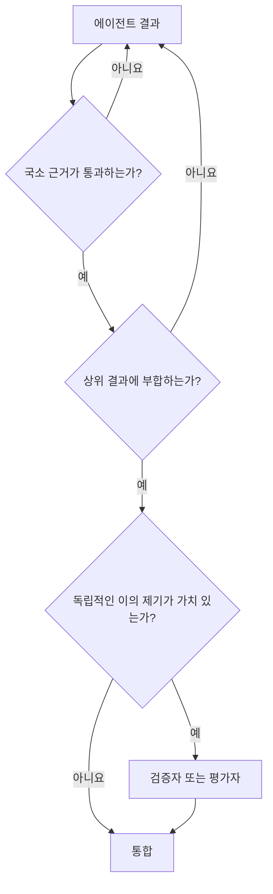

# 확장 전 검증

[HEAD Agent Core (영문)](../../../README.md) / [학습 과정 (영문)](../../../learn/README.md) / [LLM 문제 모델](README.md) / 확장 전 검증

## 학습 목표

생성된 결과가 이후 작업의 권위 있는 입력이 되기 전에 검증한다는 것이 무엇인지 정의한다.

## 확인 전까지는 초안이다

이 시스템에서 LLM이 생성한 진술, 계획, 구현, 검토는 그 주장에 적합한 관찰 가능한 근거와 대조하여 확인하기 전까지는 초안이다.

자신감, 세부 정보, 전문적인 어조는 근거가 아니다. 에이전트가 "모든 테스트가 통과했다"고 말하는 것은 테스트 출력보다 약한 근거다. 계획서가 "시스템은 이 인터페이스를 사용한다"고 말하는 것은 현재 소스나 계약보다 약하다. 요약이 "작업이 완료되었다"고 말하는 것은 원래 성공 조건과 체크리스트보다 약하다.

## 주장에 맞는 근거를 사용하라

| 주장 | 유용한 직접 근거 |
| --- | --- |
| 코드가 의도대로 동작한다 | 초점을 맞춘 테스트, 재현 가능한 명령, 런타임 관찰 |
| UI가 시각적으로 올바르다 | 요구된 뷰포트에서 렌더링한 스크린숏 |
| 파일이 의도대로 바뀌었다 | diff와 대상 콘텐츠 검사 |
| 외부 사실이 최신이다 | 1차 출처 또는 실시간 읽기 전용 쿼리 |
| 문서가 계약을 따른다 | 스키마, 링크, 범위, 출처 검사 |
| 위임한 결과가 완료되었다 | 산출물 검사와 결과 수준의 수용 기준 충족 근거 |
| 전체 작업이 완료되었다 | 원래 런 범위, 성공 조건, 완료된 체크리스트 |

## 세 가지 검증 수준

### 에이전트 자체 점검

에이전트는 자신이 소유한 결과를 검증한다. 개발자는 초점을 맞춘 테스트를 실행한다. 작성자는 요구된 구조를 검증한다. 디자이너는 렌더링된 출력을 검사한다. 이렇게 하면 진단, 실행, 직접적인 국소 근거가 함께 유지된다.

### HEAD 통합 점검

HEAD는 국소 결과가 상위 결과를 충족하고, 확정된 결정을 지키며, 의존 관계와 결합되는지를 검증한다. 기술적으로 올바른 국소 결과도 관련이 없거나 불완전하다는 이유로 거부될 수 있는 지점이다.

### 독립적인 이의 제기

다른 관점이 중대한 결과를 실질적으로 바꿀 수 있을 때는 별도의 검증자나 평가자가 유용하다. 독립성은 의무적인 형식 절차가 아니다. 서로 연관된 추론이 의미 있는 위험을 낳는 결정에 사용하는 도구다.

## 검증은 단계 이름이 아니라 경계다

경직된 워크플로에 "검증"이라는 단계가 있어도 올바른 대상을 검증하지 못할 수 있다. 한 표현이 다른 표현의 신뢰할 수 있는 입력이 되는 모든 곳에 근거 게이트가 있어야 한다.

작은 변경은 편집 후 몇 초 안에 검증할 수 있다. 큰 계획은 구현 전에 검증할 수 있다. 복구한 작업은 불러온 목표가 여전히 사용자의 승인을 받은 목표인지 확인하는 것부터 검증이 시작된다.

## 검증은 모델을 바꿀 수 있다

근거는 실행을 승인하거나 거부하는 데 그치지 않는다. 계획, 진단, 시스템 모델이 잘못되었다는 점을 드러낼 수 있다. 그런 경우 HEAD는 요청된 메커니즘을 억지로 적용하지 말고 모델을 갱신해야 한다.

결과 중심 위임이 중요한 이유가 여기에 있다. 에이전트는 상위 제품 및 정책 경계를 지키면서도 잘못된 국소 가설에 이의를 제기할 수 있다.

## 흔한 오해

검증은 에이전트를 불신하는 것과 같지 않으며, 사용자에게 모든 하위 산출물을 검사하라고 요구하지도 않는다. 근거를 올바른 추상화 수준에서 확인할 수 있도록 위계가 존재한다. 에이전트는 국소 동작을 확인하고, HEAD는 결합을 확인하며, 사용자는 중요한 방향을 확인한다.

## 핵심 정리

생성된 출력이 완전해 보인다는 이유만으로 이후 작업의 기반이 되게 하지 말라. 주장을 관찰 가능한 근거와 맞춰 본 뒤 다음 확장을 허용하라.

다음: [컨텍스트가 많다고 지능이 높아지는 것은 아니다](why-more-context-is-not-more-intelligence.md)

출처 분류: 현재 완료 계약과 운영 검증 관행.
