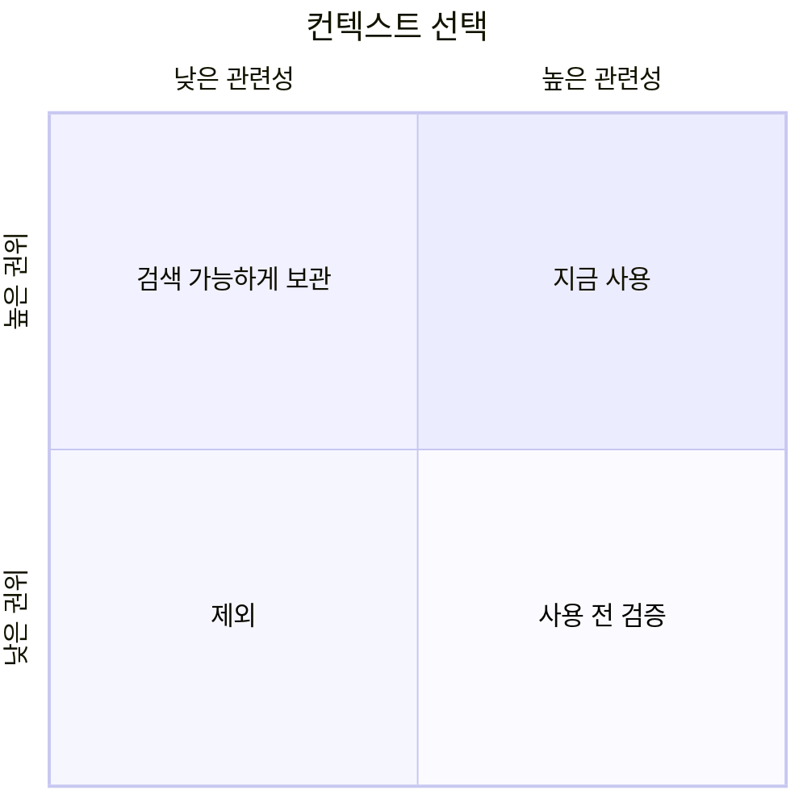

# 컨텍스트가 많다고 지능이 높아지는 것은 아니다

[HEAD Agent Core](../../README.md) / [학습](../README.md) / [LLM 문제 모델](README.md) / 컨텍스트가 많다고 지능이 높아지는 것은 아니다

## 학습 목표

프롬프트의 양을 최대화하려는 본능을 버리고, 권위를 갖는 가장 작고 완전한 작업 집합을 선택하는 모델로 대체한다.

## 컨텍스트를 쏟아붓는 본능

LLM에 어떤 사실이 없다면 더 많은 정보를 주는 것이 당연한 대응이다. 프로젝트가 커지면서 이는 기본 전략이 될 수 있다. "혹시 모르니" 저장소 안내서 전체, 관련 문서 전부, 최근 이력 모두, 도구 출력, 이전 논의를 추가하는 것이다.

이는 정보의 부재를 해결하면서 선택 문제를 만든다. 이제 모델은 어떤 출처가 최신인지, 어떤 세부 사항이 관련 있는지, 어떤 충돌이 의도적인지, 어떤 역할이 결정을 소유하는지 판단해야 한다.

컨텍스트가 많으면 가능성은 넓어진다. 판단력이 자동으로 향상되는 것은 아니다.

## 컨텍스트의 네 가지 품질

### 권위

이 출처가 답을 정의할 수 있는가, 아니면 보고서, 캐시, 요약, 가설, 역사적 산출물인가?

### 관련성

이 정보가 현재 결정이나 결과를 바꾸는가? 유용한 프로젝트 지식도 경계가 정해진 하나의 작업에는 무관할 수 있다.

### 시점

이 정보가 지금 필요한가? 상위 수준의 방향을 정할 때 구현 세부 사항을 불러오면 계획이 너무 일찍 그쪽에 고정될 수 있다. 구현 후에야 정책을 불러오면 너무 늦다.

### 소유권

허용된 결정을 내리기 위해 이 정보가 필요한 행위자는 누구인가? HEAD에는 출처를 아우르는 넓은 컨텍스트가 필요할 수 있다. 에이전트에는 하나의 결과를 위한 계약과 대상 범위만 필요할 수 있다.



시점과 소유권이 없으면 이 도표는 불완전하지만 첫 번째 요점은 분명하게 보여 준다. 양은 선택 기준이 아니다.

## 가장 작고 완전한 컨텍스트

"최소 컨텍스트"라는 말이 올바른 판단에 필요한 사실을 숨긴다는 뜻이라면 오해를 부를 수 있다. 목표는 가장 작고 완전한 컨텍스트다.

- 무관한 이력과 충돌하는 잔여물을 피할 만큼 작아야 한다.
- 목적, 확정된 결정, 관련 근거, 경계, 성공 조건을 보존할 만큼 완전해야 한다.
- 검증된 사실과 가설을 구별할 만큼 명시적이어야 한다.
- 더 깊은 근거가 필요할 때 검색할 수 있는 출처와 연결되어야 한다.

## 먼저 인덱스를 만들고 검색하라

HEAD가 항상 불러오는 프롬프트 안에 모든 프로젝트 사실을 담을 필요는 없다. 여기에는 권위 있는 정보가 어디에 있는지 보여 주는 안정적인 지도와 관련 출처를 검색하는 절차가 필요하다.

```text
작은 프로젝트 인덱스
    -> 이 질문에서 권위를 갖는 출처를 식별함
    -> 관련 출처를 검색함
    -> 필요한 부분을 검사함
    -> 가능하면 큰 원시 출력을 모델 컨텍스트 밖에 둠
```

이 설계는 모든 결정에 전체 데이터를 싣지 않고도 폭넓은 접근성을 유지한다.

## 소유자마다 필요한 컨텍스트가 다르다

| 소유자 | 컨텍스트의 형태 |
| --- | --- |
| 사용자 | 방향, 절충안, 위험, 최종 결정 범위 |
| HEAD | 전체 결과, 권위 있는 출처 포인터, 의존 관계, 결정, 통합 근거 |
| 에이전트 | 하나의 결과, 대상 근거, 확정된 결정, 국소 권한, 직접 완료 점검 |
| 검증자 | 작업을 지배하는 요구 사항, 산출물, 1차 근거, 명시적 검토 범위 |

모든 행위자에게 같은 컨텍스트를 주는 것은 중립적이지 않다. 소유권을 유용하게 만드는 구분을 지운다.

## 흔한 오해

선별적 컨텍스트는 에이전트를 무지한 상태로 두거나 결론을 조종하기 위한 구실이 아니다. 중요한 제약이 빠지면 브리핑은 불완전하다. 목표는 에이전트가 정당하게 내리는 결정에 필요한 모든 사실을 보존하면서 무관하게 넓은 범위를 제거하는 것이다.

## 핵심 정리

질문은 "모델이 얼마나 많은 컨텍스트를 담을 수 있는가?"가 아니다. "이 소유자는 이 결정 경계에서 어떤 권위 있는 정보를 반드시 보아야 하며, 무엇은 참조를 통해 검색 가능한 상태로 남길 수 있는가?"다.

다음 학습 장: [소유권: 사용자, HEAD, 그리고 경계가 정해진 에이전트](../03-ownership/README.md).

[HEAD 학습으로 돌아가기](../README.md).

출처 분류: 현재 컨텍스트 아키텍처와 운영 관찰.
