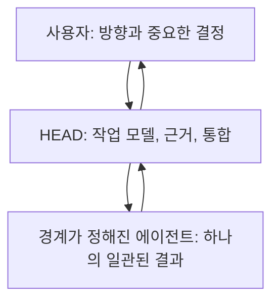

# 소유권: 사용자, HEAD, 그리고 경계가 정해진 에이전트

[HEAD Agent Core (영문)](../../../README.md) / [학습 과정 (영문)](../../../learn/README.md) / 소유권

## 학습 목표

HEAD가 단일 대화 및 통합 표면인 이유와, 에이전트가 독립적인 의사결정자가 아니라 경계가 정해진 결과를 받는 이유를 이해한다.

## 핵심 주장

이 아키텍처는 작업을 아래로 확장하되 소유권을 위로 분산하지 않는다. 사용자가 방향을 정하고, HEAD가 전체 작업 모델을 보유하며, 에이전트는 그 모델 안에서 경계가 정해진 하나의 결과를 완성한다.

## 장 구성

1. [사용자는 HEAD하고만 대화한다](user-talks-only-to-head.md)는 단일 의사결정 표면을 정의한다.
2. [높음, 중간, 낮음의 추상화 수준](high-mid-low-abstraction.md)은 방향, 작업 모델링, 실행을 구분한다.
3. [의사결정 권한](decision-rights.md)은 누가 어떤 종류의 선택을 할 수 있는지 식별한다.
4. [제어 평면으로서의 HEAD](head-as-control-plane.md)는 분리된 관리 체계가 되지 않는 오케스트레이션을 설명한다.
5. [경계가 정해진 에이전트 소유권](bounded-agent-ownership.md)은 에이전트의 완전하지만 제한된 책임을 정의한다.
6. [검증과 통합](verification-and-integration.md)은 작업이 신뢰할 수 있는 결론이 되기 전에 순환을 닫는다.

## 해석으로서의 이론

현재의 소유권 모델은 운영 실무를 통해 발전했다. 계층적 계획, 추상화 수준, 제어 평면 설계, 의사결정 권한 설계, 경계가 정해진 컨텍스트, 최소 권한, 직무 분리, 단일 책임, 의존성 스케줄링은 **사후적으로 연결한 이론 매핑**이다. 이들은 모델을 명료하게 하지만, 이 과정은 그것들이 문서화된 최초 출처였다고 주장하지 않는다.

이전: [LLM 문제 모델](../02-llm-problem/README.md) | 다음: [사용자는 HEAD하고만 대화한다](user-talks-only-to-head.md)

출처 분류: 현재의 소유권 및 위임 계약; 사후적 설계 이론 해석.
