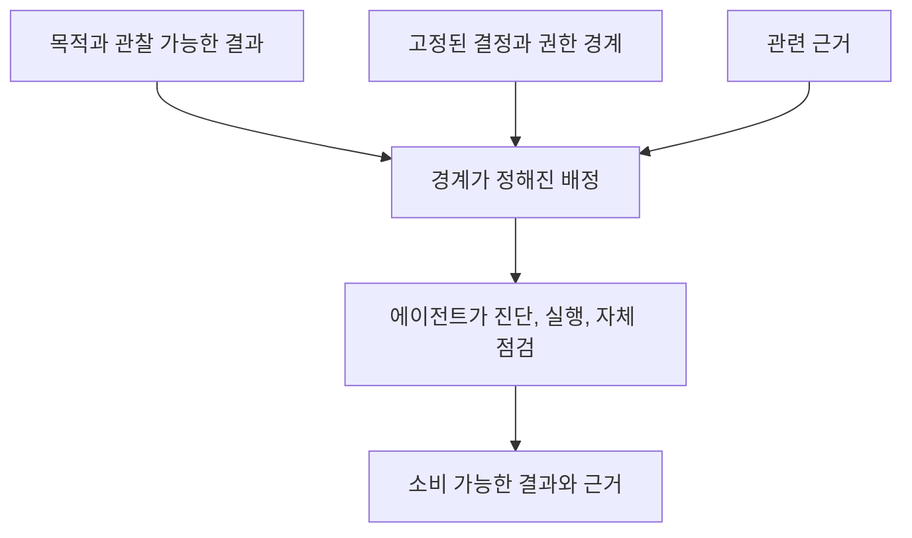

# 경계가 정해진 에이전트 소유권

[HEAD Agent Core (영문)](../../../README.md) / [학습 과정 (영문)](../../../learn/README.md) / [소유권](README.md) / 경계가 정해진 에이전트 소유권

## 학습 목표

에이전트 배정을 처음부터 끝까지 완료할 충분한 컨텍스트와 권한을 가진 하나의 일관된 결과로 정의한다.

## 가장 작은 완전한 배정

유용한 에이전트 배정은 한 소유자에게 독립적으로 관찰할 수 있는 결과를 준다. 여기에는 목적, 고정된 결정, 관련 근거, 허용된 표면, 직접 완료 근거가 포함된다. 이는 작업 경계를 세우는 HEAD의 책임을 넓은 프로젝트 탐색으로 대체하지 않는다.

경계는 추측성 작업을 피할 만큼 작고 발명을 막을 만큼 완전하다. 에이전트에게 경계 밖의 중요한 결정이 필요하면, 에이전트는 위임 범위를 조용히 넓히는 대신 근거를 보고한다.

## 단계 목록이 아니라 결과인 이유

고정된 프로토콜 자체가 요구될 때는 상세 단계 목록이 유용할 수 있다. 그렇지 않으면 검증되지 않은 진단을 고정하고 결과보다 활동을 보상할 수 있다. 결과는 수용 목표를 보이게 유지하면서 에이전트가 더 나은 국소 방법을 선택할 여지를 보존한다.

## 사후적으로 연결한 이론

**관련 이론, 사후적:** 이는 경계가 정해진 컨텍스트, 최소 권한, 단일 책임과 닮아 있다. 이 매핑은 설명을 위한 것이며 이 개념들이 실무의 문서화된 최초 출처였다고 주장하지 않는다.

## 흔한 오해

경계가 정해졌다는 말이 작다는 뜻은 아니다. 에이전트는 근거, 결정, 변경 표면이 하나의 일관된 단위를 이룬다면 상당한 결과를 소유할 수 있다.

## 요점

서로 분리된 단계 더미나 미해결 프로젝트 전체가 아니라 완전한 결과를 위임한다.

이전: [제어 평면으로서의 HEAD](head-as-control-plane.md) | 다음: [검증과 통합](verification-and-integration.md)

출처 분류: 현재의 위임 계약과 운영 실무; 사후적 설계 이론 해석.
