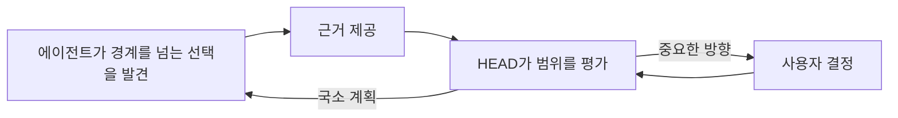

# 의사결정 권한

[HEAD Agent Core](../../README.md) / [학습](../README.md) / [소유권](README.md) / 의사결정 권한

## 학습 목표

어떤 결정이 사용자, HEAD, 경계가 정해진 에이전트에게 속하는지와 필요한 결정이 없을 때 무엇이 일어나는지를 알아본다.

## 권한은 결과와 범위를 따른다

| 결정 | 기본 소유자 | 이유 |
| --- | --- | --- |
| 제품 방향, 정책, 중요한 아키텍처, 워크플로, 위험, 비용 또는 그 밖의 중요한 절충 | 사용자 | 이 선택들은 성공이 무엇을 의미하도록 허용되는지 정의한다. |
| 계획, 근거 선택, 순서화, 통합 | HEAD | 전체 결과와 그 의존성이 필요하다. |
| 고정된 경계 안의 국소 기술 방법 | 에이전트 | 목표와 직접 완료 근거에 가장 가깝다. |

이 표는 기본값이지, 없는 정책을 추론해도 된다는 허가가 아니다. 누락된 선택이 제품, 중요한 아키텍처나 워크플로, 위험 태세, 또는 수용 대상을 바꾼다면, HEAD는 에이전트가 이를 만들어 내게 하지 않고 사용자와 함께 해결한다.

## 유용한 에스컬레이션

에이전트는 제공된 가정이 잘못되었음을 발견할 수 있다. 에이전트는 관련 근거를 제시하고 권한 경계에서 멈춰야 한다. 그러면 HEAD가 문제가 국소적인지, 재계획이 필요한지, 혹은 사용자에게 돌려야 할 만큼 중요한지 결정한다.

## 사후적으로 연결한 이론

**관련 이론, 사후적:** 이는 의사결정 권한 설계와 직무 분리에 대응한다. 이 매핑은 구별된 권한 경계가 우발적인 정책 발명을 줄이는 이유를 설명하지만, 더 이른 이론적 설계 과정을 확립하지는 않는다.

## 흔한 오해

의사결정 권한은 모든 행동이 승인을 기다리게 만드는 수단이 아니다. 안전한 곳에서 국소 자율성을 명시하여 불필요한 승인을 없앤다.

## 요점

각 결정은 필요한 컨텍스트와 정당한 권한을 가진 소유자에게 주고, 나머지는 드러나게 에스컬레이션한다.

이전: [높음, 중간, 낮음의 추상화 수준](high-mid-low-abstraction.md) | 다음: [제어 평면으로서의 HEAD](head-as-control-plane.md)

출처 분류: 현재의 소유권 및 위임 계약; 사후적 설계 이론 해석.
