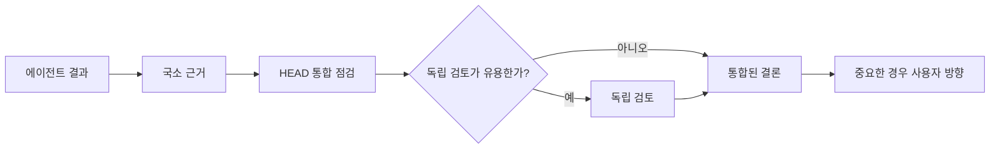

# 검증과 통합

[HEAD Agent Core](../../README.md) / [학습](../README.md) / [소유권](README.md) / 검증과 통합

## 학습 목표

에이전트의 자체 점검을 HEAD의 결과 수준 통합 및 선택적 독립 검토와 구분한다.

## 완료에는 하나 이상의 범위가 있다

에이전트는 자신이 소유한 산출물과 행동을 검증한다. 그다음 HEAD는 그 결과를 상위 결과, 고정된 결정, 의존성과 대조하여 검증한다. 별도의 관점이 중요한 결론을 실질적으로 바꿀 수 있다면 독립 검토자가 그 결론에 이의를 제기할 수 있다. 중요한 선택에 관한 최종 방향은 사용자가 보유한다.

## 통합이 별도인 이유

국소적으로 올바른 결과도 불완전하거나, 의존성과 충돌하거나, 대체된 질문에 답할 수 있다. 반대로 통합 점검이 에이전트의 직접 근거를 대체하는 척해서도 안 된다. 각 점검은 관련 실패를 관찰할 수 있는 추상화 수준에 속한다.

## 사후적으로 연결한 이론

**관련 이론, 사후적:** 이 분리는 직무 분리와 계층화된 보증을 닮아 있다. 이는 나중의 설명 매핑이지, 문서화된 원래 설계 출처에 관한 주장이 아니다.

## 흔한 오해

독립 검토는 의무적인 의식이 아니다. 상관된 추론이나 오류의 결과가 또 다른 근거 기반 관점을 정당화할 때 유용하다.

## 요점

신뢰는 근거와 함께 위로 이동해야 한다. 결과에는 국소 근거, 결과물 전체에는 통합 근거, 중요한 선택에는 사용자 방향이 필요하다.

이전: [경계가 정해진 에이전트 소유권](bounded-agent-ownership.md) | 다음: [컨텍스트](../04-context/README.md)

출처 분류: 현재의 완료 및 위임 계약; 사후적 설계 이론 해석.
