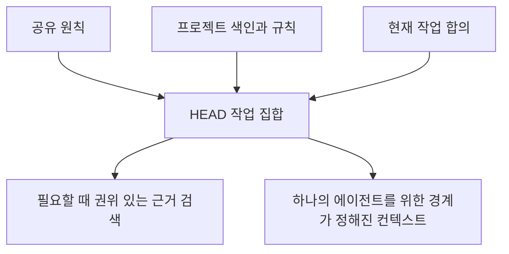

# 컨텍스트: 관리되는 작업 집합

[HEAD Agent Core (영문)](../../../README.md) / [학습 과정 (영문)](../../../learn/README.md) / 컨텍스트

## 학습 목표

컨텍스트를 우연히 이용 가능한 모든 사실이 아니라 특정 소유자와 결과를 위해 선택된 정보로 이해한다.

## 핵심 주장

컨텍스트의 품질은 네 질문에 달려 있다. 정보가 권위 있는가, 지금 관련 있는가, 적절한 시점에 이용 가능한가, 올바른 계층이 소유하는가? 더 많은 자료는 이 질문들의 답이 빠진 것을 고칠 수 없다.

## 장 구성

1. [소유권에 따른 컨텍스트](context-by-ownership.md)는 전체 프로젝트, 결과, 작업 컨텍스트를 구분한다.
2. [항상 로드되는 것과 검색되는 것](always-loaded-vs-retrieved.md)은 안정적인 지침과 필요 시 근거를 구분한다.
3. [본문이 아닌 색인](index-not-payload.md)은 색인이 권위를 가장하지 않고 판단을 안내하는 방식을 설명한다.
4. [공유 컨텍스트와 프로젝트 컨텍스트](shared-vs-project-context.md)는 이식 가능한 원칙을 국소 사실과 분리한다.
5. [HEAD를 위한 컨텍스트](context-for-head.md)는 HEAD가 작업을 판단하고 구성하는 데 필요한 폭을 정의한다.
6. [에이전트를 위한 컨텍스트](context-for-workers.md)는 완전하지만 경계가 정해진 배정을 정의한다.
7. [컨텍스트 안티패턴](context-antipatterns.md)은 컨텍스트가 가치를 잃는 일반적 방식을 식별한다.

## 요점

현재 소유자가 다음의 건전한 결정을 내리게 하는 가장 작은 권위 있는 작업 집합을 구성한다.

이전: [소유권](../03-ownership/README.md) | 다음: [소유권에 따른 컨텍스트](context-by-ownership.md)

출처 분류: 현재의 공유 Core 원칙과 컨텍스트 관리 아키텍처; 운영 설계 지침.
