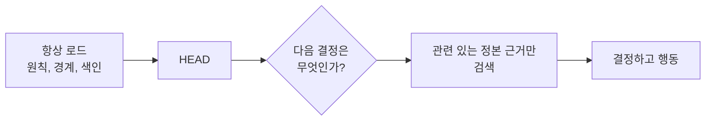

# 항상 로드되는 것과 검색되는 것

[HEAD Agent Core](../../README.md) / [학습](../README.md) / [컨텍스트](README.md) / 항상 로드되는 것과 검색되는 것

## 학습 목표

안정적이고 자동적이어야 하는 정보와 구체적 필요가 있을 때만 검색해야 하는 정보를 선택한다.

## 안정적인 지침, 시의적절한 근거

항상 로드되는 컨텍스트는 작고, 오래 유지되며, 폭넓게 적용되어야 한다. 소유권 원칙, 엄격한 경계, 권위로 가는 경로가 그 예다. 상세 근거는 현재 결과와 관련 있을 때 검색해야 한다. 이렇게 하면 당면한 결정에 주의를 집중하고, 바뀔 수 있는 사실을 사용 시점 가까이에서 확인할 수 있다.

## 설계 대응

작고 안정적인 기반과 명시적 검색을 사용한다. 거부된 대안은 언젠가 중요할 수 있는 모든 문서를 미리 로드하는 것이다. 미리 로드하면 관련성이 흐려지고, 오래된 복사본이 다음 단계까지 이어지며, 나중의 사실을 출처까지 추적하기 어려워진다.

## 시점도 중요하다

권위 있는 문서라도 바뀐 외부 조건을 설명한다면 그 순간에는 틀릴 수 있다. 검색은 단지 토큰 절약을 위한 것이 아니라, 바뀔 수 있는 근거에 의존하기 전에 다시 확인할 기회다.

## 흔한 오해

검색된다는 말은 선택 사항이거나 약하다는 뜻이 아니다. 중요한 결과를 낳는 결정에는 항상 로드되는 규칙보다 더 많은 근거가 필요할 수 있다. 단지 관련 없는 모든 작업 집합에 속하지 않을 뿐이다.

## 요점

안정적인 규칙은 자동으로 로드한다. 상세하거나 바뀔 수 있거나 특정 결과에만 필요한 근거는 작업이 요구할 때 검색한다.

이전: [소유권에 따른 컨텍스트](context-by-ownership.md) | 다음: [본문이 아닌 색인](index-not-payload.md)

출처 분류: 현재의 공유 Core 원칙과 컨텍스트 관리 아키텍처; 운영 설계 지침.
