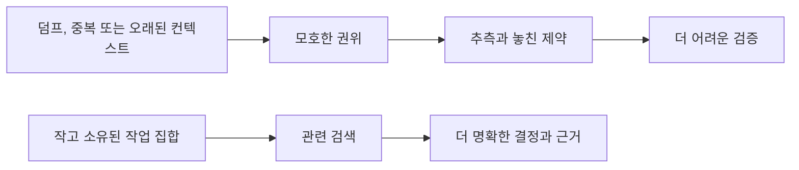

# 컨텍스트 안티패턴

[HEAD Agent Core](../../README.md) / [학습](../README.md) / [컨텍스트](README.md) / 컨텍스트 안티패턴

## 학습 목표

작업 집합을 크고, 오래되고, 모호하거나 소유권에서 분리되게 만드는 패턴을 알아본다.

## 실패 패턴

| 패턴 | 실패 이유 | 더 나은 대응 |
| --- | --- | --- |
| 컨텍스트 덤프 | 분량이 결정에 관련된 자료를 가린다. | 안정적인 지침을 로드하고 결과를 위한 근거를 검색한다. |
| 권위로 쓰이는 오래된 요약 | 압축된 기록은 제약을 누락하거나 바꿀 수 있다. | 소유된 합의와 정본 출처로 돌아간다. |
| 중복 정책 | 복사본은 표류하며 어느 버전이 적용되는지 감춘다. | 소유된 출처 하나를 유지하고 그것을 가리킨다. |
| 경계 없는 탐색 | 에이전트가 작업을 찾으려 하며 범위를 발명한다. | HEAD가 경계가 정해진 결과와 근거 집합을 세운다. |
| 복사된 이력 | 이전 활동이 다음 결정을 바꾸지 않으면서 주의를 소비한다. | 이력은 참조로 검색 가능하게 둔다. |

## 일반화된 실패

**일반화된 실패:** 중단 뒤에는 짧아진 인계가 원래 합의의 일부를 빼면서도 작업을 설명하는 듯 보일 수 있다. 그러면 작업은 사용자의 전체 목표가 아니라 축소된 설명에 맞춰 완료되고 점검될 수 있다. 실패는 요약이 쓸모없다는 것이 아니라, 취약한 검색 보조물을 최종 준거가 되는 출처로 취급하는 것이다.

## 설계 대응

지속되는 작업에는 정본 합의를 사용하고, 이력은 검색을 위해 보존하며, 필요할 때 상세 근거를 명시적으로 검색한다. 거부된 대안은 하나가 완전해 보일 때까지 더 많은 복사 요약과 대체 기록을 더하는 것이다. 더 많은 파생 기록은 권위를 복원하는 대신 모호성을 키운다.

## 흔한 오해

답은 모든 상황에서 최소 프롬프트가 아니다. 내용이 소유자와 현재 목적까지 추적될 수 있도록 의도적으로 구성된 작업 집합이다.

## 요점

현재 결정에 영향을 줄 수 없는 컨텍스트는 제거하고, 편리한 복사본이 정본 출처보다 앞서게 하지 않는다.

이전: [에이전트를 위한 컨텍스트](context-for-workers.md) | 다음: [일반 규칙](../05-general-rules/README.md)

출처 분류: 현재의 컨텍스트 관리 아키텍처와 일반화된 운영 실패; 프로젝트별 사고 세부 사항 없음.
