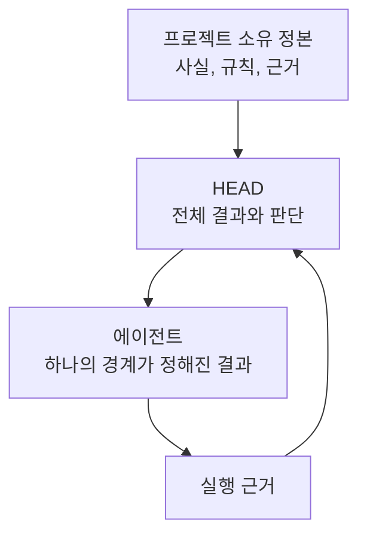

# 소유권에 따른 컨텍스트

[HEAD Agent Core (영문)](../../../README.md) / [학습 과정 (영문)](../../../learn/README.md) / [컨텍스트](README.md) / 소유권에 따른 컨텍스트

## 학습 목표

프로젝트, HEAD, 경계가 정해진 에이전트에 속하는 컨텍스트를 구분한다.

## 서로 다른 소유자에게는 서로 다른 컨텍스트가 필요하다

프로젝트는 사실, 정책, 정본 근거를 소유한다. HEAD는 전체 작업 모델을 소유한다. 즉, 요청을 해석하고, 근거를 선택하고, 의존성을 연결하고, 결과를 통합할 충분한 폭이 필요하다. 에이전트는 하나의 일관된 결과를 소유하며 그 결과를 실행 가능하게 하는 부분집합만 필요하다.

에이전트에게 모든 프로젝트 컨텍스트를 주는 것은 HEAD가 여전히 소유하는 탐색과 정책 해석을 이전한다. HEAD에게 작업 조각만 주면 건전한 통합이 불가능하다. 올바른 경계는 고정된 프롬프트 크기가 아니라 책임을 따른다.

## 설계 대응

정본 자료는 변경 소유자와 함께 두고, HEAD에는 포인터와 관련 근거를 주며, 에이전트 브리프는 독립적으로 관찰 가능한 하나의 결과에 맞춘다. 거부된 대안은 보편적 컨텍스트 묶음이다. 이는 완전해 보이지만 권위를 불명확하게 하고 오래되거나 관련 없는 자료를 늘린다.

## 사후적으로 연결한 이론

**관련 이론, 사후적:** 이는 경계가 정해진 컨텍스트, 최소 권한, 직무 분리와 닮아 있다. 이 개념들은 설계를 설명하며 문서화된 최초 출처로 제시되지는 않는다.

## 흔한 오해

소유권을 분리한다고 정보 사일로가 되는 것은 아니다. HEAD는 프로젝트 근거를 검색해 필요한 부분을 전달할 수 있다. 각 소유자가 실제 의사결정 권한에 맞는 정보를 받는다는 뜻이다.

## 요점

컨텍스트는 소유권에 따라 확장하고 좁힌다. 프로젝트 정본, HEAD의 작업 모델, 그다음 에이전트의 경계가 정해진 배정이다.

이전: [컨텍스트](README.md) | 다음: [항상 로드되는 것과 검색되는 것](always-loaded-vs-retrieved.md)

출처 분류: 현재의 공유 Core 원칙, 위임 계약, 컨텍스트 관리 아키텍처.
