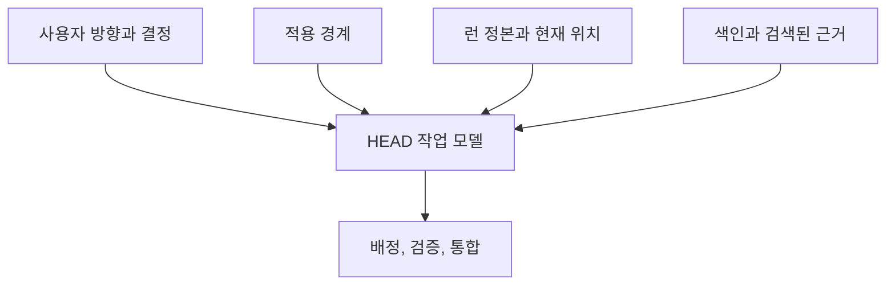

# HEAD를 위한 컨텍스트

[HEAD Agent Core (영문)](../../../README.md) / [학습 과정 (영문)](../../../learn/README.md) / [컨텍스트](README.md) / HEAD를 위한 컨텍스트

## 학습 목표

HEAD가 전체 결과를 판단, 계획, 배정, 통합하는 데 필요한 컨텍스트를 식별한다.

## 판단을 위한 폭

HEAD는 이해, 실행 전략, 컨텍스트 구성, 통합, 결론을 소유한다. 따라서 작업 집합에는 사용자 방향, 적용 경계, 현재 작업 합의, 의존성 그림, 관련 근거로 가는 경로가 필요하다. 모든 프로젝트 문서를 한꺼번에 필요로 하지는 않는다.

## 설계 대응

HEAD는 결과 간 관계를 평가하고 어떤 근거를 검색할지 결정할 충분한 폭을 구성한다. 거부된 대안은 HEAD를 메시지 중계로 취급하는 것이다. 중계는 작업을 전달할 수 있지만 의존성을 안정적으로 해결하거나 합의를 보존하거나 에이전트 결과가 그 안에 구성되는지 판단할 수 없다.

## 관련성과 시점

HEAD의 컨텍스트는 작업이 바뀌면 바뀐다. 계획에는 관련 있던 출처가 좁은 편집에는 관련 없을 수 있고, 바뀔 수 있는 사실은 통합 전에 다시 확인해야 할 수 있다. 안정적인 작업 합의는 이 변화하는 작업 집합의 기준점이 되지만 검색을 기억으로 대체하지는 않는다.

## 흔한 오해

전체 결과 소유권에는 전지성이 필요하지 않다. 결정 전에 필요한 근거를 찾아 판단할 책임이 필요하다.

## 요점

HEAD에게 전체 결과를 소유하는 데 필요한 합의, 경계, 관계, 근거 경로를 주고, 다음 판단을 바꾸는 세부 사항은 검색한다.

이전: [공유 컨텍스트와 프로젝트 컨텍스트](shared-vs-project-context.md) | 다음: [에이전트를 위한 컨텍스트](context-for-workers.md)

출처 분류: 현재의 공유 Core 원칙과 컨텍스트 관리 아키텍처.
