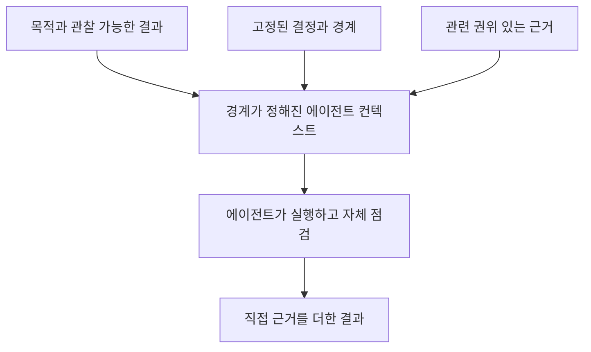

# 에이전트를 위한 컨텍스트

[HEAD Agent Core (영문)](../../../README.md) / [학습 과정 (영문)](../../../learn/README.md) / [컨텍스트](README.md) / 에이전트를 위한 컨텍스트

## 학습 목표

하나의 결과에는 완전하지만 HEAD의 더 넓은 소유권을 이전하지 않는 에이전트 컨텍스트를 구성한다.

## 경계가 정해진 브리프

에이전트는 하나의 일관된 결과, 그 목적, 고정된 결정, 관련 근거, 허용된 표면, 완료를 보여 줄 근거를 받는다. 이는 에이전트에게 프로젝트 방향을 추론하거나 작업 모델을 다시 쓰라고 요구하지 않으면서 국소 진단과 실행의 여지를 준다.

## 설계 대응

배정은 독립적으로 관찰 가능한 결과에 맞추고, 에이전트가 그 경계 안에서 국소 방법을 선택하게 한다. 거부된 대안은 광범위한 이력과 무엇이 중요한지 발견하라는 열린 지시를 보내는 것이다. 이는 추측을 부르고, 권한을 확장하며, 완료를 검증하기 어렵게 한다.

중요한 선택이 브리프 밖에 있으면 에이전트는 문제와 뒷받침 근거를 보고한다. 배정을 조용히 확장하지 않는다. 에이전트 보고는 실행 근거이며, HEAD는 이를 정본 결론으로 취급하기 전에 검증한다.

## 사후적으로 연결한 이론

**관련 이론, 사후적:** 이는 최소 권한, 경계가 정해진 컨텍스트, 단일 책임과 닮아 있다. 이 비교는 설명을 위한 관점이며 이론 명칭이 실무의 기원이었다는 주장이 아니다.

## 흔한 오해

경계가 정해진 컨텍스트는 의도적으로 불완전한 컨텍스트가 아니다. 약속한 결과를 만들고 입증하는 데 필요한 정보가 아니라 관련 없는 이력을 뺀다.

## 요점

에이전트에게 검증 가능한 하나의 결과에 필요한 가장 작은 완전한 권위 있는 정보 집합과 명확한 에스컬레이션 경계를 준다.

이전: [HEAD를 위한 컨텍스트](context-for-head.md) | 다음: [컨텍스트 안티패턴](context-antipatterns.md)

출처 분류: 현재의 공유 위임 계약과 컨텍스트 관리 아키텍처.
