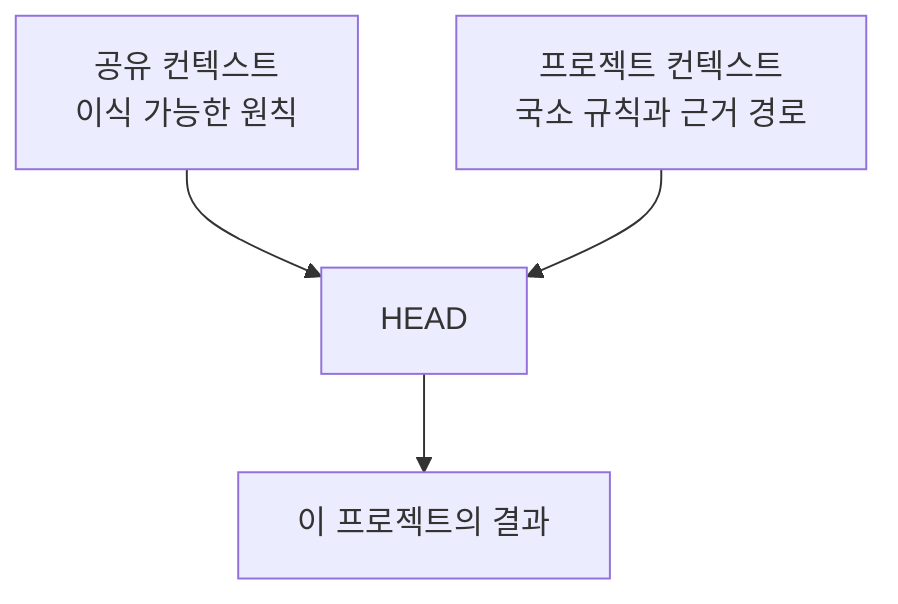

# 공유 컨텍스트와 프로젝트 컨텍스트

[HEAD Agent Core](../../README.md) / [학습](../README.md) / [컨텍스트](README.md) / 공유 컨텍스트와 프로젝트 컨텍스트

## 학습 목표

이식 가능한 운영 원칙을 프로젝트별 사실 및 결정과 분리한다.

## 두 변경 소유자

공유 컨텍스트는 프로젝트 이름, 도메인 사실, 전문 분야 라우팅, 비공개 데이터가 제거된 뒤에도 유용한 원칙을 담는다. 프로젝트 컨텍스트는 한 환경에서 작업을 올바르게 만드는 사실, 정책, 도구, 국소 권위를 담는다. 이들은 서로 복사되지 않고 사용 시점에 구성된다.

## 설계 대응

공유 지침은 작고 생성적으로 유지하고, 프로젝트가 바뀌는 세부 사항을 소유하게 한다. 거부된 대안은 프로젝트 오버레이를 보편 규칙처럼 공개하거나 모든 프로젝트에 보편 지침을 넣는 것이다. 둘 다 표류를 만들고 공개 경계를 넘을 수 있다.

## 권한 경계

공유 원칙은 추론을 안내하지만 프로젝트 결정을 허가하지는 않는다. 프로젝트 정책은 적용 가능한 국소 제약을 제공할 수 있지만, 중요한 방향은 사용자에게 남는다. 이식 가능한 계층은 프로젝트만 확립할 수 있는 사실을 발명해서는 안 된다.

## 흔한 오해

공유된다고 프로젝트 정책보다 더 권위 있는 것은 아니다. 계층은 서로 다른 질문에 답한다. 어떻게 추론하고 작업을 소유할지, 여기서 무엇이 참이고 허용되는지다.

## 요점

국소 사실이 제거되어도 남는 원칙을 공유하고, 국소 사실·정책·기능은 그것을 소유하는 프로젝트에 둔다.

이전: [본문이 아닌 색인](index-not-payload.md) | 다음: [HEAD를 위한 컨텍스트](context-for-head.md)

출처 분류: 현재의 공유 Core 원칙과 공개된 공유/프로젝트 아키텍처.
