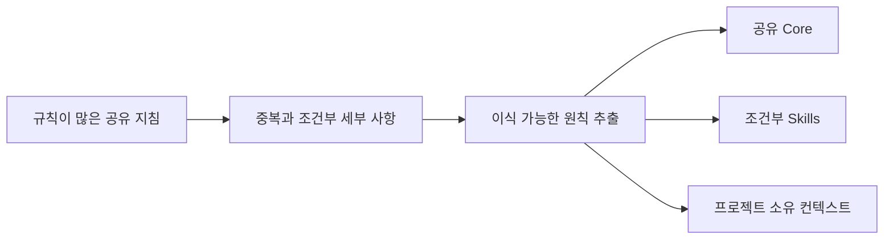

# HEAD Core 발전

[HEAD Agent Core (영문)](../../../README.md) / [학습 과정 (영문)](../../../learn/README.md) / [일반 규칙](README.md) / HEAD Core 발전

## 학습 목표

비공개 지시문 내용을 재현하지 않고 규칙이 많은 공유 Core를 간결한 이식 가능 원칙 집합으로 줄이는 설계 근거를 이해한다.

## 전환은 경험 뒤의 단순화였다

이전의 공유 지침에는 더 상세한 규칙과 엄격한 한계가 있었다. 이후 개정은 그 상세 대부분을 간결한 원칙과 조건부 Skills로 바꿨다. 의도한 설계 효과는 필요한 경계를 보존하면서 중복, 유지보수 비용, 과도한 일반화를 줄이는 것이다. 이 효과들은 측정된 역사적 결과가 아니라 설계 근거로 제시된 것이다.

현재 방향은 공유 Core를 오래 유지되는 소유권 및 추론 원칙에 집중시키는 것이다. 상세 워크플로는 조건부 Skills로 옮기고, 프로젝트 사실과 정책은 프로젝트가 소유한다. 이는 두 버전의 지시문 본문 재현이 아니라 설계 근거 비교다.

## 바뀌지 않은 것

단순화가 안전, 검증, 권한 경계를 없애지는 않는다. 세부 사항이 어디에 있고 얼마나 넓게 로드되는지를 바꾼다. 간결한 Core에도 상황이 요구할 때 명시적인 프로젝트 정책과 작업별 절차가 필요하다.

## 역사적 지위

**역사 기록:** 저장소 변화 과정과 현재 공유 자료는 누적된 지침에서 간결한 원칙 및 조건부 절차로 옮겨 간 전환을 뒷받침한다. 이 페이지는 의도적으로 그 공개된 설계 근거 수준에 머문다. 비공개 프롬프트, 내부 문구, 모든 중간 구현에 관해서는 주장하지 않는다.

## 흔한 오해

더 짧은 Core가 자동으로 더 나은 것은 아니다. 제거된 글이 중복적이거나 지나치게 구체적이거나 조건부 또는 프로젝트별 계층이 더 정확히 소유할 때에만 더 낫다.

## 요점

공유 기반은 이식 가능하게 남을 만큼 작게 유지하고, 구체성은 조건과 소유자가 보이는 곳에 둔다.

이전: [에이전트 자율성 보존](preserving-agent-autonomy.md) | 돌아가기: [일반 규칙](README.md) | 다음: [정본](../06-canon/README.md)

출처 분류: 공유 Core 저장소 발전; 현재 공유 Core와 계획 Skills.
