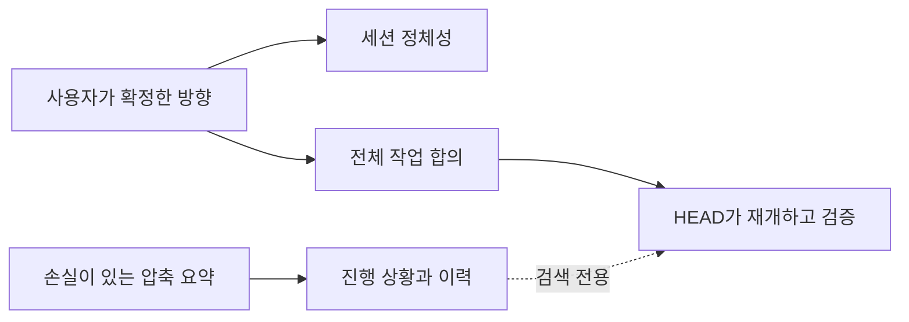

# 정본: 압축을 거쳐 합의를 유지하기

[HEAD Agent Core (영문)](../../../README.md) / [학습 (영문)](../../../learn/README.md) / 정본

## 학습 목표

사용자가 확정한 작업 합의가 왜 손실이 있는 모델 요약 밖에 남아 있어야 하는지, 그리고 작고 고정된 복구 계약이 이를 어떻게 보존하는지 이해합니다.

## 핵심 주장

압축은 유용한 인계 정보를 보존할 수 있지만, 사용자가 무엇을 요청했는지 또는 무엇을 완료로 볼지를 정하는 권위가 될 수는 없습니다. 오래 유지되는 합의는 별도의 세션 파일에서 계속 사용할 수 있습니다.

## 장 구성도

1. [압축이 잃는 것](what-compaction-loses.md)은 요약이 완전한 합의가 아닌 이유를 보입니다.
2. [문제와 목표 고정하기](fixing-the-problem-and-goal.md)는 정본으로 남아야 하는 정보를 명명합니다.
3. [컨텍스트와 런](context-and-run.md)은 안정적인 세션 정체성과 전체 작업 합의를 구분합니다.
4. [취약한 진행 상황과 이력](fragile-progress-and-history.md)은 권위를 부여하지 않고 검색 가치를 유지합니다.
5. [실패한 복구 이야기](the-failed-recovery-story.md)는 검증이 축소된 범위만을 통과시킨 실패를 일반화합니다.
6. [두 파일 계약](the-two-file-contract.md)은 고정 경로 복구와 거부한 대체 메커니즘을 설명합니다.

## 범위

이 장은 요약에 가치가 없다는 보편적 주장이 아니라 현재 공유 복구 계약을 설명합니다. 프로젝트 컨텍스트, 비공개 작업 기록, 내부 경로 또는 구현 본문을 공개하지 않습니다. 공개 참조 컨텍스트는 [공유 Core (영문)](../../../head/README.md)와 저장소 [아키텍처 개요 (영문)](../../../README.md)를 참조하세요.

이전: [일반 규칙](../05-general-rules/README.md) | 다음: [압축이 잃는 것](what-compaction-loses.md)

출처 분류: 현재 공유 런타임 계약; 일반화된 실패; 운영 관찰.
