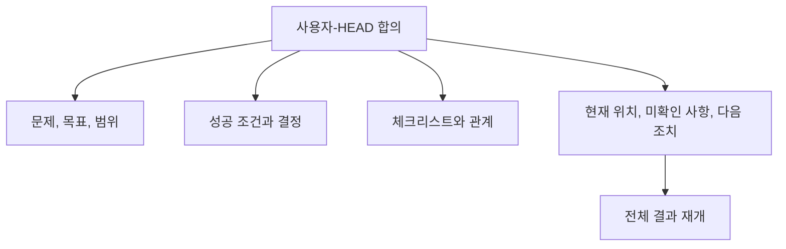

# 문제와 목표 고정하기

[HEAD Agent Core (영문)](../../../README.md) / [학습 (영문)](../../../learn/README.md) / [정본](README.md) / 문제와 목표 고정하기

## 학습 목표

최선의 노력으로 만든 인계가 아니라 사용자-HEAD 합의로서, 중단을 거쳐 남아야 하는 정보를 파악합니다.

## 오래 유지되는 작업 모델

사소하지 않은 작업에서 오래 유지되는 합의는 가장 최근 활동만이 아니라 전체 결과를 재개하는 데 필요한 정보를 보존합니다.

| 정본 요소 | 복구 시 중요한 이유 |
| --- | --- |
| 고정된 문제와 목표 | 국지적 결과가 목적지가 되는 것을 막습니다. |
| 의도한 범위 | 포함된 작업과 그럴듯하지만 승인되지 않은 추가를 구분합니다. |
| 성공 조건 | 검증이 합의한 결과를 향하게 합니다. |
| 사용자 결정 | 일반적인 계획 수립이 다시 열어서는 안 되는 선택을 보존합니다. |
| 작업 관계와 체크리스트 | 전체 모델에서 완료된 작업과 남은 작업을 보입니다. |
| 현재 위치 | 작업을 다시 정의하지 않고 위치를 찾습니다. |
| 검증되지 않은 가정 | 조용히 해결하지 않고 불확실성을 명시합니다. |
| 정확한 다음 조치 | 복구에 구체적이고 확인 가능한 다음 진행을 제공합니다. |
| 근거 위치 | 이후의 주장을 그 출처에서 확인할 수 있게 합니다. |

## 변경될 수 있는 것

HEAD는 작업이 진전됨에 따라 체크리스트와 현재 위치를 갱신합니다. 합의된 요구 사항, 범위, 성공 조건 및 전체 모델은 이후 요약, 보고서 또는 국지적 구현이 더 좁은 해석을 시사한다는 이유만으로 바뀌지 않습니다. 이 합의를 변경하는 것은 사용자입니다.

## 관련 이론

이는 제어면 기록과 닮았습니다. 오래 유지되는 방향은 운영에 사용되는 변화하는 관찰과 구분됩니다. 이는 회고적 해석이지 설계의 원래 출처에 관한 주장이 아닙니다.

## 요점

정본은 대상을 고정하고 작업의 현 위치를 기록합니다. 일반적인 실행을 동결하지는 않습니다.

이전: [압축이 잃는 것](what-compaction-loses.md) | 다음: [컨텍스트와 런](context-and-run.md)

출처 분류: 현재 공유 복구 계약.
