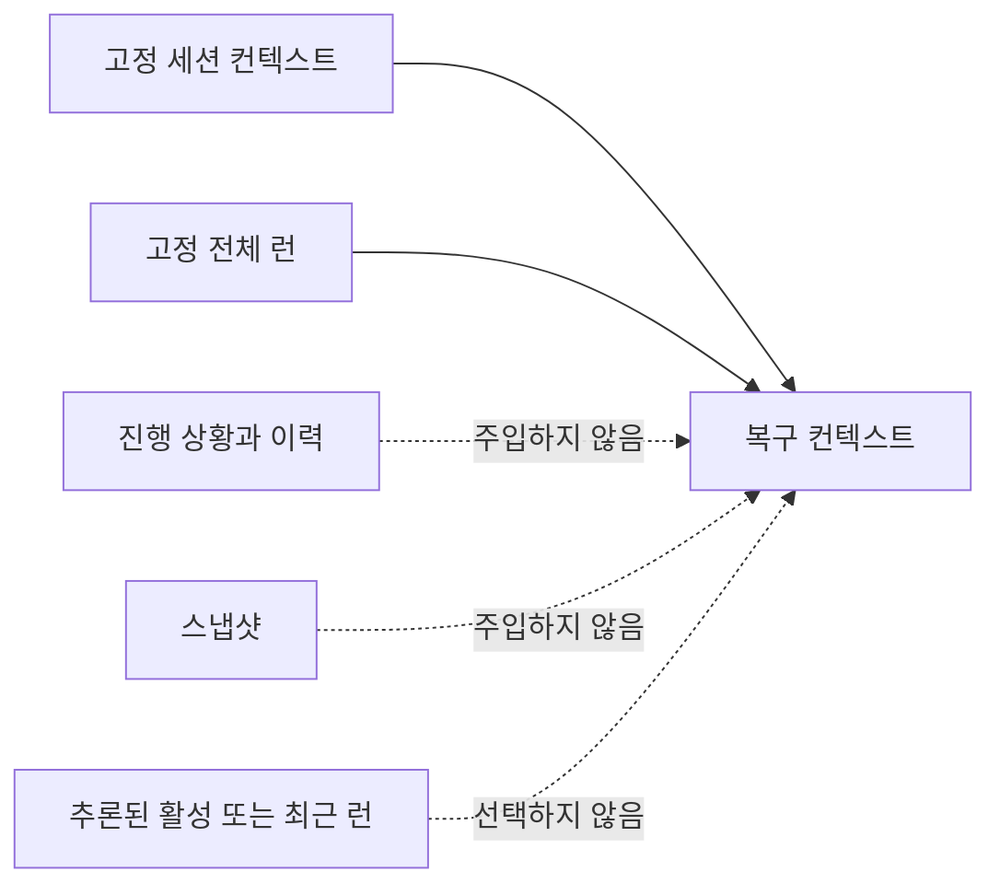

# 두 파일 계약

[HEAD Agent Core](../../README.md) / [학습](../README.md) / [정본](README.md) / 두 파일 계약

## 학습 목표

복구가 왜 두 고정 파일을 순서대로 읽고, 추론에 의한 선택과 대체 메커니즘을 의도적으로 피하는지 이해합니다.

## 고정된 복구 기반

복구 시 런타임은 세션의 고정 컨텍스트 파일과 고정 런 파일을 이 순서대로 읽습니다. 둘 중 하나가 없으면 조용히 생략합니다. 대체물을 선택하지 않습니다.

이 작은 계약은 의도적입니다. 복구 입력을 검사할 수 있게 합니다. HEAD는 숨겨진 선택 과정에서 추론하는 대신 어떤 오래 유지되는 출처가 복구 입력에 포함됐는지 알 수 있습니다.

## 대체 선택이 합의를 대신하지 않는 이유

추론된 활성 런, 최근 런 추측, 스냅샷 또는 대체 후보는 사람이 이끄는 조사에서 유용한 정보일 수 있습니다. 어느 것도 지금 복구하는 세션의 사용자-HEAD 합의임을 증명하지는 않습니다. 하나를 자동으로 선택하면 복구에 신뢰할 수 있는 작업 모델이 필요한 바로 그때 잘못된 작업 모델을 도입할 수 있습니다.

이는 진행 상황과 이력에도 같습니다. 활동을 설명할 수는 있지만, 합의가 보존해야 하는 범위, 성공 조건, 사용자 결정, 현재 위치, 미확인 사항 및 정확한 다음 조치를 확립할 수는 없습니다.

## 설계 대응과 한계

시스템은 탐색 알고리즘, 포인터, 이상 게이트, 대화 기록 대체 또는 스냅샷 대체보다 고정 경로를 선호합니다. 이는 복구 장치를 단순화하고 조용한 대체를 피합니다. 고정 파일이 없으면 복구는 대체물을 발명하지 않고 그 파일 없이 진행합니다. 누락된 합의는 명시적으로 해결할 조건이지 자동 추측의 기회가 아닙니다.

## 흔한 오해

고정 경로가 모든 복구를 자동으로 만드는 것은 아닙니다. HEAD는 여전히 런의 체크리스트를 따르고, 필요할 때 슬라이스나 근거를 명시적으로 검색하며, 행동하기 전에 변경 가능한 사실을 다시 확인합니다.

## 요점

단순한 복구가 덜 신중한 것은 아닙니다. 어떤 파생 기록이 합의를 대신해야 하는지 추측하기를 거부하여 권위의 경계를 보존합니다.

이전: [실패한 복구 이야기](the-failed-recovery-story.md) | 돌아가기: [정본](README.md) | 다음: [구성 요소](../07-components/README.md)

출처 분류: 현재 공유 런타임 계약; 운영 관찰.
