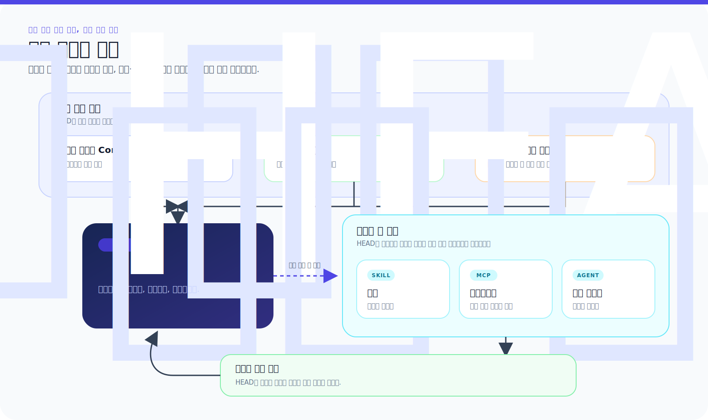

# 구성 요소: 통제된 시스템의 부분들

[HEAD Agent Core](../../README.md) / [학습](../README.md) / 구성 요소

## 학습 목표

각 아키텍처 계층이 무엇을 소유하는지, 언제 사용할 수 있게 되는지, 그리고 호출 가능한 역량, 절차, 결과 소유자가 왜 서로 바꿔 쓸 수 없는지 식별합니다.

## 핵심 주장

HEAD는 하나의 거대한 프롬프트가 아닙니다. 서로 다른 소유자와 제공 시점을 가진 작은 계층들의 조합입니다. 이 분리는 이식 가능한 추론을 안정적으로 유지하고, 로컬 지식을 비공개로 유지하며, 실행에 책임을 부여합니다.

## 장 구성도

1. [Core](core.md)는 이식 가능하며 항상 로드되는 소유권과 추론 원칙을 정립합니다.
2. [프로젝트 컨텍스트](project-context.md)는 로컬 규칙, 인덱스 및 검색 경로를 제공합니다.
3. [MCP](mcp.md)는 호출 가능한 인터페이스와 강제 가능한 런타임 경계를 정의합니다.
4. [Skills](skills.md)는 조건부 절차와 사용 지식을 담습니다.
5. [Agents](agents.md)는 경계가 정해진 결과를 위한 재사용 가능한 소유자를 정의합니다.
6. [런타임 정본](runtime-canon.md)은 중단과 복구를 거쳐 합의를 보존합니다.
7. [부분들이 조합되는 방식](how-the-parts-compose.md)은 하나의 통제된 루프를 따라 계층을 살펴봅니다.

## 범주 오류를 막는 구분

| 질문 | 답하는 계층 |
| --- | --- |
| HEAD는 어떻게 추론하고 소유권을 유지해야 하는가? | Core |
| 이 프로젝트에서 무엇이 사실이거나 허용되며, 증명은 어디에 있는가? | 프로젝트 컨텍스트 |
| 런타임은 어떤 작업을 호출하고 강제할 수 있는가? | MCP |
| 일치하는 작업은 언제 어떻게 수행해야 하는가? | Skill |
| 이 일관된 결과는 누가 어떤 권한 경계 안에서 소유하는가? | Agent |
| 사용자와 HEAD는 무엇을 달성하기로 합의했는가? | 런타임 정본 |

이 계층들은 협력하지만 어느 것도 다른 하나를 대신할 수 없습니다. 도구는 권한을 부여하지 않습니다. 절차는 작업자가 결과에 책임지게 하지 않습니다. 작업자 보고서는 작업 합의를 대체하지 않습니다.

## 참조 경로

현재 공개 계약은 [공유 Core (영문)](../../../head/README.md), [프로젝트 계층 (영문)](../../../projects/README.md), [공유 MCP (영문)](../../../mcp/README.md), [공유 Skills (영문)](../../../skills/README.md), [공유 Agents (영문)](../../../agents/README.md), [세션 정본 (영문)](../../../projects/context/session-canon.md)을 참조하세요.

## 요점

조합은 통제 설계입니다. 오래 유지되는 원칙을 로드하고, 로컬 권위 출처를 검색하고, 필요에 따라 인터페이스를 호출하며, 일치할 때 절차를 로드하고, 경계가 정해진 소유권을 할당하고, 내내 합의를 보존합니다.

이전: [정본](../06-canon/README.md) | 다음: [Core](core.md) | 이후: [운영](../08-operation/README.md)

출처 분류: 현재 공개 공유 및 프로젝트 확장 참조 페이지; 현재 공유 런타임 계약.
