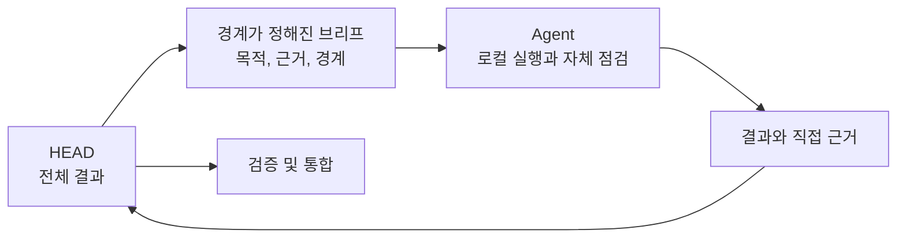

# Agents: 경계가 정해진 결과의 재사용 가능한 소유자

[HEAD Agent Core](../../README.md) / [학습](../README.md) / [구성 요소](README.md) / Agents

## 학습 목표

Agent를 범용 자율 참여자가 아니라 명시적 권한을 가진 재사용 가능한 소유권 계약으로 이해합니다.

## Agent가 소유하는 것

Agent는 진단에서 직접 근거 확보까지 완수하는 데 필요한 가장 작은 완전한 컨텍스트와 하나의 일관되고 관찰 가능한 결과를 받습니다. 계약은 역할의 권한 경계, 예상 결과 및 반환 규율을 정의합니다. HEAD는 전체 작업 모델, 결과 간 의존성, 통합 및 최종 결론을 유지합니다.

이 경계는 Agent에게 정책을 발명하거나, 범위를 확장하거나, 중요한 사용자 결정을 확정할 권한을 주지 않으면서 로컬 기술 판단의 여지를 줍니다. 작업이 그러한 결정에 이르면 Agent는 근거와 질문을 HEAD에 반환합니다.

## 역할은 메커니즘이 아니다

Agent는 Skill을 로드하고 MCP를 호출할 수 있지만, 이들은 서로 다른 일을 합니다. Skill은 방법을 제공합니다. MCP는 런타임 규칙 아래 호출 가능한 역량을 제공합니다. Agent는 경계가 정해진 결과의 책임 있는 소유권을 제공합니다. 셋 중 어느 것도 나머지를 보장하지 않습니다.

## 공유 및 프로젝트 Agents

공유 Agent 계약은 프로젝트 전반에서 재사용 가능한 소유권 형태를 보존합니다. 프로젝트는 소유자가 여전히 일관된 결과와 명시적 권한을 가진다면 로컬 저장소 규칙을 덧씌우거나 도메인별 전문가를 정의할 수 있습니다. 로컬 라우팅과 근거 출처는 프로젝트가 소유합니다.

## 참조 경로

[공유 Agents (영문)](../../../agents/README.md), [개발자 Core (영문)](../../../agents/developer/README.md), [검증자 Core (영문)](../../../agents/validator/README.md), [프로젝트 Agents (영문)](../../../projects/agents/README.md)를 참조하세요. 기반 할당 모델은 [경계가 정해진 Agent 소유권](../03-ownership/bounded-agent-ownership.md)에서 소개합니다.

## 요점

명시적 한계가 있는 완전하고 관찰 가능한 결과를 Agent에 할당하세요. 해결되지 않은 전체 프로젝트나 HEAD 또는 사용자에게 남아 있는 결정을 위임하지 마세요.

이전: [Skills](skills.md) | 다음: [런타임 정본](runtime-canon.md)

출처 분류: 현재 공개 Agent 참조 페이지; 현재 위임 및 소유권 모델.
