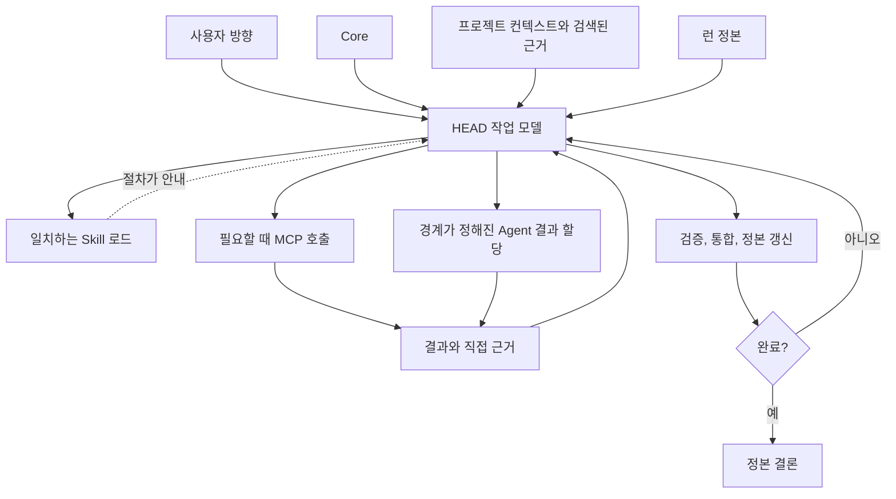

# 부분들이 조합되는 방식

[HEAD Agent Core](../../README.md) / [학습](../README.md) / [구성 요소](README.md) / 부분들이 조합되는 방식

## 학습 목표

Core, 프로젝트 컨텍스트, 런타임 정본, Skills, MCP, Agents, 근거 및 HEAD 통합을 거치는 공개해도 안전한 결과 하나를 추적합니다.

## 하나의 통제된 루프

공개 워크숍 안내서를 요청하는 지역 단체를 생각해 봅시다. 요청은 의도한 결과와 중요한 선택을 고정합니다. HEAD는 그 방향을 작업 모델로 만듭니다. 즉, 알려진 것, 확인해야 할 것, 어떤 결과가 조합되는지, 어떤 직접 근거가 완료를 보일지를 정합니다.

1. **Core:** HEAD는 전체 결과의 소유권을 유지하고 사용자 결정을 일반적인 계획 수립과 구분합니다.
2. **프로젝트 컨텍스트:** HEAD는 프로젝트 인덱스를 사용해 현재 승인된 접근성 지침과 장소 브리프를 찾고, 관련 출처만 검색합니다.
3. **런타임 정본:** 작업 합의는 목표, 범위, 성공 조건, 결정, 검증되지 않은 가정 및 다음 조치를 기록하여 중단을 견딜 수 있게 합니다.
4. **Skill:** 일치하는 작성 또는 검토 절차가 조건부 방법과 근거 기대를 제공합니다.
5. **MCP:** 런타임 작업이 필요할 때 HEAD는 적절한 인터페이스를 호출하고, 그 계약은 허용된 경계를 강제합니다.
6. **Agent:** HEAD는 검색한 요구 사항을 기준으로 안내서를 점검하는 일처럼, 필수 근거와 명시적 권한 경계를 갖춘 하나의 경계가 정해진 결과를 할당합니다.
7. **검증과 통합:** HEAD는 반환된 근거를 출처와 합의에 비추어 점검하고, 결과를 통합하며, 다음 경계가 정해진 확장을 결정하거나 중요한 선택을 사용자에게 묻습니다.

## 다이어그램이 말하지 않는 것

모든 요청에 모든 구성 요소가 필요한 것은 아닙니다. 작고 즉시 검증 가능한 작업에는 오래 유지되는 런이나 위임이 필요 없을 수 있습니다. 호출 가능한 인터페이스가 필요하지 않으면 MCP도 불필요할 수 있습니다. Skill은 절차가 일치할 때만 로드됩니다. 불변 조건은 모든 장치를 동원하는 것이 아니라 작업 규모에 맞춰 권위, 관련 근거 및 관찰 가능한 완료를 보존하는 것입니다.

## 실패 점검

| 이런 일이 일어나면... | 흔히 빠진 구분은... |
| --- | --- |
| 호출 가능한 도구가 범위를 바꿀 권한으로 취급됨 | 인터페이스와 결정 권한 |
| 절차가 올바른 결과를 보장한다고 가정됨 | 방법과 검증 |
| 작업자에게 방대한 이력이 주어지지만 관찰 가능한 대상은 주어지지 않음 | 컨텍스트 양과 경계가 정해진 소유권 |
| 압축 요약이 작업 정의가 됨 | 검색 기록과 런타임 정본 |
| 로컬 사실이 공유 지침에 추가됨 | 이식 가능한 Core와 프로젝트 컨텍스트 |

## 참조 경로

[아키텍처 개요](../../README.md)로 돌아가 [공유 Core (영문)](../../../head/README.md), [프로젝트 계층 (영문)](../../../projects/README.md), [공유 MCP (영문)](../../../mcp/README.md), [공유 Skills (영문)](../../../skills/README.md), [공유 Agents (영문)](../../../agents/README.md), [세션 정본 (영문)](../../../projects/context/session-canon.md)으로 연결된 링크를 따르세요.

## 요점

HEAD는 필요한 시점에 계층을 조합합니다. 원칙은 판단을 안내하고, 프로젝트 컨텍스트는 로컬 사실을 확립하며, 정본은 합의를 보존하고, Skills는 절차를 안내하며, MCP는 강제 가능한 작업을 노출하고, Agents는 검증과 통합을 위한 경계가 정해진 근거를 반환합니다.

이전: [런타임 정본](runtime-canon.md) | 돌아가기: [구성 요소](README.md) | 다음: [운영](../08-operation/README.md)

출처 분류: 현재 공개 아키텍처 및 런타임 참조 페이지; 일반화된 운영 예시.
