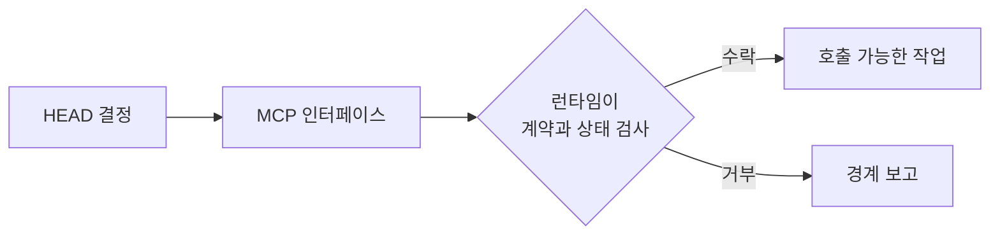

# MCP: 호출 가능한 인터페이스와 강제된 경계

[HEAD Agent Core (영문)](../../../README.md) / [학습 (영문)](../../../learn/README.md) / [구성 요소](README.md) / MCP

## 학습 목표

작업의 안전성과 세션 경계를 강제할 수 있는 능력을 포함해 MCP를 런타임의 호출 가능한 인터페이스 계층으로 이해합니다.

## MCP가 제공하는 것

MCP는 정의된 작업을 런타임에 노출합니다. 계약은 입력을 제한하고, 지원하지 않는 요청을 거부하고, 호출을 읽기 전용 행동으로 제한하고, 승인 단계를 요구하거나, 세션 제어를 정확한 런타임 상태에 묶을 수 있습니다. 이는 단지 프롬프트의 조언이 아니라 인터페이스와 그 강제의 속성입니다.

인터페이스는 역량을 사용할 수 있게 합니다. 그 역량이 결과에 적절한지는 결정하지 않으며, 호출로 만들어진 결과를 소유하지도 않습니다.

## 도구, 절차, 소유권

| 대상 | 주된 질문 | 제공하지 않는 것 |
| --- | --- | --- |
| MCP | 런타임은 이 계약 아래 무엇을 호출할 수 있는가? | 작업별 방법 또는 결과 소유자 |
| Skill | 일치하는 작업은 언제 어떻게 수행해야 하는가? | 런타임이 강제하는 호출 가능한 인터페이스 |
| Agent | 누가 이 경계가 정해진 결과를 완료까지 수행할 수 있는가? | 자동으로 부여되는 권한 또는 절차 |

예를 들어 조정 인터페이스는 경계가 정해진 작업자 작업을 시작할 수 있는 반면, 위임 Skill은 그 작업을 구성하는 방법을 설명하고, 위임이 적절한지 결정하는 책임은 HEAD에 남습니다. 할당된 결과를 소유하는 것은 인터페이스가 아니라 작업자입니다.

## 공유 및 프로젝트 인터페이스

인터페이스는 로컬 사실을 제거한 뒤에도 계약이 유용하고 안전하게 남을 때 공유됩니다. 로컬 자격 증명, 비공개 스키마 또는 프로젝트별 변경 규칙에 의존하는 인터페이스는 프로젝트 계층에 속합니다. 두 유형 모두 필요에 따라 호출됩니다.

## 참조 경로

[공유 MCP (영문)](../../../mcp/README.md), 공개 [agent-task 참조 (영문)](../../../mcp/agent-task/README.md), [프로젝트 MCP (영문)](../../../projects/mcp/README.md)를 참조하세요. 짝이 되는 절차는 [delegate-task (영문)](../../../skills/delegate-task/README.md)를 참조하세요.

## 요점

MCP는 작업을 호출 가능하게 하고 그 경계를 강제할 수 있습니다. Skill의 판단이나 Agent 할당의 책임을 대체하지는 않습니다.

이전: [프로젝트 컨텍스트](project-context.md) | 다음: [Skills](skills.md)

출처 분류: 현재 공개 MCP 참조 페이지; 현재 도구 및 조정 아키텍처.
