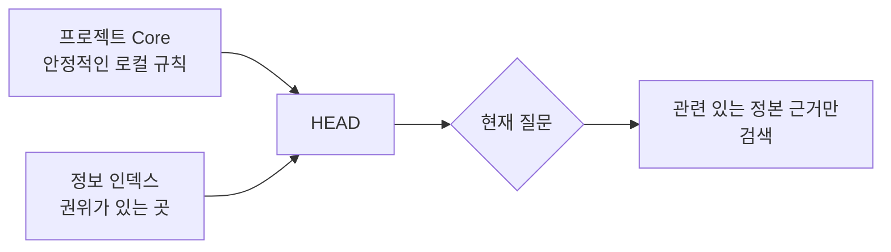

# 프로젝트 컨텍스트: 로컬 사실과 검색 경로

[HEAD Agent Core (영문)](../../../README.md) / [학습 (영문)](../../../learn/README.md) / [구성 요소](README.md) / 프로젝트 컨텍스트

## 학습 목표

프로젝트 소유 규칙과 사실을 이식 가능한 Core에서 분리하고, 인덱스가 모든 지식을 활성 컨텍스트에 복사하는 대신 근거로 가는 경로를 제공하는 이유를 이해합니다.

## 프로젝트 컨텍스트가 소유하는 것

모든 프로젝트는 공유 Core가 알 수 없는 사실, 즉 로컬 권한 경계, 안정적인 규칙, 정본 출처, 상세 근거를 검색하는 데 쓰는 경로를 제공합니다. 작은 프로젝트 Core는 처음부터 이용 가능할 수 있으며, 프로젝트 정보 인덱스는 현재 결과에 필요할 때만 읽는 더 깊은 출처를 가리킵니다.

인덱스는 출처의 대체물이 아닙니다. 크거나, 오래됐거나, 서로 충돌하는 컨텍스트 덤프를 피하면서 HEAD가 주장을 소유한 출처를 찾도록 돕습니다.

## 소유권 경계

프로젝트 컨텍스트는 공유 원칙이 로컬에서 적용되는 방식을 제한할 수 있지만, 그 원칙의 이식 가능한 의미를 바꾸지는 않습니다. 또한 중요한 사용자 소유 질문을 조용히 결정하지 않습니다. 근거가 없거나 결정이 사용자 소유일 때 HEAD는 로컬 규칙을 추론하지 않고 그 공백을 드러내야 합니다.

## 공개 안전 예시

공개 행사를 위한 안내서를 준비하는 시민 워크숍 팀을 상상해 보세요. 프로젝트 컨텍스트는 승인된 접근성 정책과 현재 장소 브리프를 권위 있는 출처로 식별합니다. HEAD는 안내서를 점검할 때 이 출처를 검색합니다. 과거의 모든 행사 메모를 미리 로드하거나 오래된 요약을 현재 정책으로 취급하지 않습니다.

이 예시는 비공개 데이터 모델이 아니라 경로를 보입니다. 프로젝트 컨텍스트는 권위가 있는 곳을 식별하고, 출처는 사실을 확립합니다.

## 참조 경로

[프로젝트 계층 (영문)](../../../projects/README.md), [프로젝트 Core (영문)](../../../projects/core/README.md), [추가 컨텍스트 (영문)](../../../projects/context/README.md)를 참조하세요. 공개 컨텍스트 인덱스 모델은 [프로젝트 정보 인덱스 (영문)](../../../projects/context/project-index.md)에 설명되어 있습니다.

## 요점

프로젝트 컨텍스트는 로컬 사실과 증명으로 가는 경로를 소유합니다. 런타임에서 Core와 조합되며 공유 계층이나 모든 할당에 복사되지 않습니다.

이전: [Core](core.md) | 다음: [MCP](mcp.md)

출처 분류: 현재 공개 프로젝트 확장 참조 페이지; 컨텍스트 관리 아키텍처.
