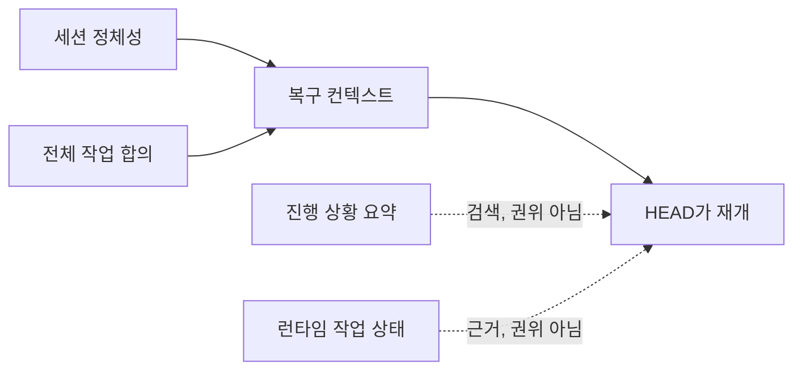

# 런타임 정본: 합의 보존하기

[HEAD Agent Core (영문)](../../../README.md) / [학습 (영문)](../../../learn/README.md) / [구성 요소](README.md) / 런타임 정본

## 학습 목표

런타임 복구가 임시 요약, 작업 상태, 작업자 보고서와 별도로 사용자-HEAD 합의를 보존하는 이유를 이해합니다.

## 런타임 정본이 보존하는 것

활성 작업에는 오래 유지되는 권위 기록, 즉 요청된 결과, 범위, 성공 조건, 결정, 현재 상황, 다음 조치를 설명하는 세션 정체성과 전체 합의가 필요합니다. 복구는 그 정본을 다시 로드하므로 중단이나 압축이 합의를 더 짧은 모델 생성 설명으로 조용히 대체할 수 없습니다.

런타임 상태는 여전히 유용할 수 있습니다. 실행 중인 작업, 인계 또는 과거 활동을 설명할 수 있습니다. 그런 유용성이 곧 런타임 상태에 사용자-HEAD 합의보다 높은 권위를 부여하지는 않습니다. Agent 보고서도 마찬가지입니다. 이는 HEAD가 검증할 근거이지 작업 범위의 변경이 아닙니다.

## 다른 구성 요소와의 관계

Core는 오래 유지되는 작업이 정본에서 계속된다고 말합니다. 프로젝트 컨텍스트는 로컬 사실을 다시 점검하는 데 필요한 출처를 제공합니다. Skills는 복구 절차를 규정할 수 있습니다. MCP 인터페이스는 런타임 작업을 통제할 수 있습니다. Agents는 경계가 정해진 작업을 반환할 수 있습니다. 런타임 정본은 이 모든 행동을 같은 사용자-HEAD 합의에 묶어 두는 계층입니다.

## 참조 경로

[세션 정본 (영문)](../../../projects/context/session-canon.md), [압축 런타임 계약 (영문)](../../../runtime/opencode/COMPACT_CONTRACT.md), 앞 장의 [두 파일 계약](../06-canon/the-two-file-contract.md)을 참조하세요.

## 요점

합의를 모델 요약 밖에 보존하세요. 런타임 기록과 작업자 출력을 정본에 비추어 확인할 때까지 유용한 근거로 취급하세요.

이전: [Agents](agents.md) | 다음: [부분들이 조합되는 방식](how-the-parts-compose.md)

출처 분류: 현재 공개 세션 정본 및 런타임 계약 참조 페이지; 컨텍스트 관리 아키텍처.
