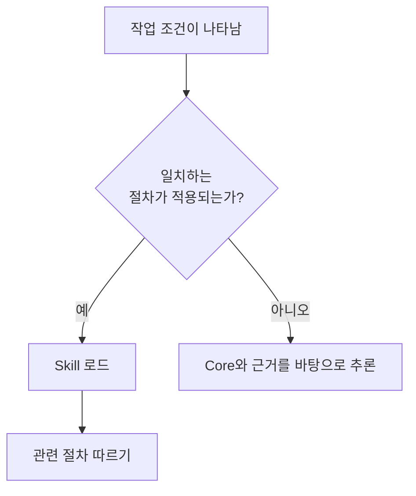

# Skills: 결정 시점에 로드되는 절차

[HEAD Agent Core (영문)](../../../README.md) / [학습 (영문)](../../../learn/README.md) / [구성 요소](README.md) / Skills

## 학습 목표

상세 워크플로와 도메인 사용 지식이 항상 로드되는 Core를 확장하는 대신 필요에 따라 로드되는 이유를 이해합니다.

## Skill이 제공하는 것

Skill은 인식 가능한 상황을 위한 절차입니다. 전제 조건, 근거 순서, 인터페이스의 안전한 사용, 흔한 함정, 예상 결과 형식을 설명할 수 있습니다. 트리거가 작업과 일치할 때 로드되어 기본 컨텍스트가 안정적인 원칙에 집중하게 합니다.

Skills는 해당 지식이 프로젝트에 속할 때 도메인 사용 지식을 포함할 수 있습니다. 공유 라이브러리에는 트리거, 권한 경계 및 결과가 로컬 사실 없이도 유의미하게 남는 절차만 포함됩니다.

## Skill이 도구가 아닌 이유

Skill은 HEAD에게 MCP, 스크립트 또는 허용된 다른 메커니즘을 사용하도록 지시할 수 있습니다. 그래도 메커니즘 자체는 아닙니다. 런타임은 인터페이스 계약을 강제하고, Skill은 작업별 방법을 설명합니다. 두 구분을 모두 보이게 유지하면 산문이 기술적 안전 경계로 오인되는 것을 막을 수 있습니다.

마찬가지로 Skill은 결과를 소유하지 않습니다. 소유자를 안내할 수는 있지만, HEAD 또는 경계가 정해진 Agent가 결과와 그 근거에 책임을 집니다.

## 참조 경로

[공유 Skills (영문)](../../../skills/README.md)에서 [start-work (영문)](../../../skills/start-work/README.md), [restore-session (영문)](../../../skills/restore-session/README.md), [delegate-task (영문)](../../../skills/delegate-task/README.md)를 포함한 재사용 가능한 절차를 살펴보세요. 로컬 워크플로는 [프로젝트 Skills (영문)](../../../projects/skills/README.md)에 속합니다.

## 요점

조건부 노하우에는 Skills를 사용하세요. Core는 이식 가능하게 유지하고, MCP가 호출 가능한 경계를 강제하게 하며, 결과의 명시적 소유권을 유지하세요.

이전: [MCP](mcp.md) | 다음: [Agents](agents.md)

출처 분류: 현재 공개 Skill 및 프로젝트 확장 참조 페이지; 계획 관행.
