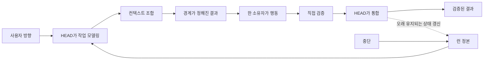

# 운영: 요청에서 검증된 결과까지

[HEAD Agent Core (영문)](../../../README.md) / [학습 (영문)](../../../learn/README.md) / 운영

## 학습 목표

중요한 결정을 사용자에게서 옮기지 않으면서 요청을 관찰된 통합 결과로 바꾸는, 작업 규모에 맞춰 조절되는 운영 루프를 배웁니다.

## 핵심 주장

이 루프는 의식이 아닙니다. HEAD는 조정, 불확실성 또는 복구 필요 때문에 구조가 유용할 때만 이를 더하고, 각 결과를 하류 작업의 입력으로 사용하기 전에 검증합니다.

## 장 구성도

1. [소규모 작업과 오래 유지되는 작업](small-work-vs-durable-work.md)
2. [작업 모델 만들기](building-the-work-model.md)
3. [컨텍스트 조합](composing-context.md)
4. [경계가 정해진 결과 구성](shaping-a-bounded-outcome.md)
5. [위임](delegation.md)
6. [검증](verification.md)
7. [통합](integration.md)
8. [복구](recovery.md)
9. [엔드 투 엔드 예시](end-to-end-example.md)

## 범위

이 장은 필수 워크플로 엔진이 아니라 운영 모델을 가르칩니다. 현재 인터페이스와 계약은 공개 [Core (영문)](../../../head/README.md), [MCP (영문)](../../../mcp/README.md), [Skills (영문)](../../../skills/README.md), [Agents (영문)](../../../agents/README.md), [프로젝트 계층 (영문)](../../../projects/README.md) 참조에 남아 있습니다.

이전 개념 장: [구성 요소](../07-components/README.md) | 다음: [소규모 작업과 오래 유지되는 작업](small-work-vs-durable-work.md)

출처 분류: 현재 공유 원칙; 현재 공개 참조 계약; 운영 관찰.
