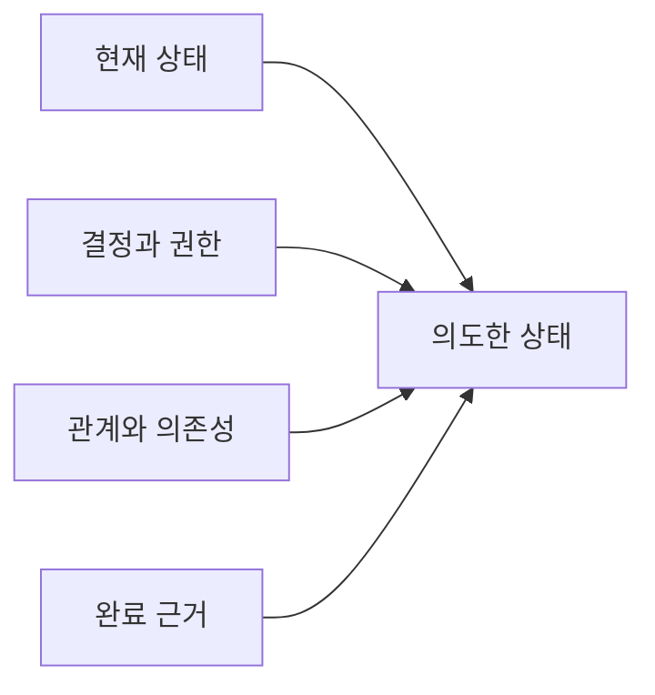

# 작업 모델 만들기

[HEAD Agent Core](../../README.md) / [학습](../README.md) / [운영](README.md) / 작업 모델 만들기

## 학습 목표

사소하지 않은 작업을 행동으로 확장하기 전에 그 구조를 명시합니다.

## 핵심 주장

작업 모델은 관계, 의존성, 결정 및 완료 근거를 통해 현재 상태를 의도한 상태에 연결합니다. 이는 판단을 위한 표현이지 고정된 문서 템플릿이 아닙니다.

## 구성 관점

행동 목록은 단계가 왜 중요한지 또는 안전하게 병렬 실행할 수 있는지를 숨길 수 있습니다. 작업 모델은 지금 무엇이 존재하는지, 무엇이 참이 되어야 하는지, 누가 변경을 결정할 수 있는지, 어떤 결과가 서로 의존하는지, 어떤 관찰이 완료를 확립할지를 묻습니다.

## 설계 대응

HEAD는 전체 모델을 유지하고 다음 일관된 결과를 실행 깊이까지 상세화합니다. 사용자는 중요한 방향을 유지합니다. 작업자를 사용할 경우, 더 큰 목표를 다시 쓰는 대신 경계가 정해진 결과 안에서 로컬 기술 수단을 선택합니다.

## 관련 이론

이는 의존성을 인식하는 계획과 방향성 비순환 그래프(DAG) 스케줄링과 닮았습니다. 이는 회고적 설명을 위한 관점이지 특정 이론이 시스템의 역사를 규정했다는 주장이 아닙니다.

## 흔한 오해

명시적이라고 해서 모든 것을 예측한다는 뜻은 아닙니다. 근거가 모델이 틀렸음을 드러낼 수 있습니다. 오래된 계획을 방어하기보다 계속하기 전에 갱신하세요.

## 요점

완료를 결정하는 조건과 관계를 모델링한 다음 그 모델에서 행동하세요.

이전: [소규모 작업과 오래 유지되는 작업](small-work-vs-durable-work.md) | 다음: [컨텍스트 조합](composing-context.md)

출처 분류: 현재 공유 원칙; 관련 이론.
