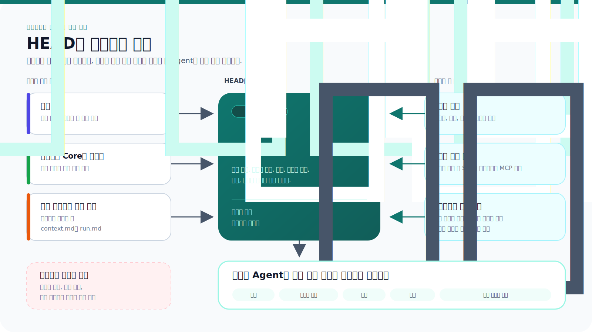

# 컨텍스트 조합

[HEAD Agent Core](../../README.md) / [학습](../README.md) / [운영](README.md) / 컨텍스트 조합

## 학습 목표

현재 결과를 바꿀 수 있는 가장 작은 권위 있는 작업 집합을 구성합니다.

## 핵심 주장

컨텍스트는 권위, 관련성, 시점 및 소유권으로 선택합니다. 인덱스는 페이로드 덤프가 되지 않고 검색을 안내할 수 있으며, 각 소유자는 자신의 결정을 내리는 데 필요한 정보만 받습니다.

## 설계 대응

HEAD는 전체 결과를 판단할 만큼 넓은 컨텍스트를 사용한 다음, 경계가 정해진 브리프에 선택한 근거를 인용합니다. 브리프에는 목적, 고정된 결정, 경계, 관련 출처 및 필수 완료 근거가 포함됩니다. 결과를 바꾸지 않는 넓은 이력은 생략합니다.

## 거부한 대안

모든 것을 로드하면 의도적으로 제외하는 것이 없으므로 안전해 보입니다. 그러나 오래된 규칙, 충돌하는 사실 및 숨은 권위를 도입합니다. 긴 컨텍스트는 올바른 출처를 사용했다는 증명이 아닙니다.

## 공개 참조

[프로젝트 컨텍스트 인덱스 모델 (영문)](../../../projects/context/README.md)은 인덱싱된 검색을 설명합니다. [공유 Core (영문)](../../../head/README.md)는 이식 가능한 추론 경계를 말합니다. 어느 페이지도 프로젝트가 소유한 권위 출처를 대체하지 않습니다.

## 요점

사용할 수 있다는 이유가 아니라 결정이나 검증 대상을 바꾸기 때문에 컨텍스트를 검색하세요.

이전: [작업 모델 만들기](building-the-work-model.md) | 다음: [경계가 정해진 결과 구성](shaping-a-bounded-outcome.md)

출처 분류: 현재 공유 원칙; 현재 공개 참조 계약.
