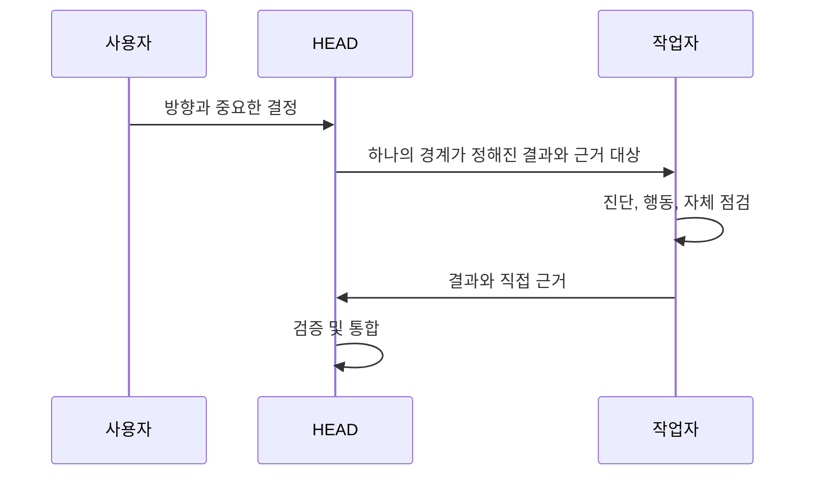

# 위임

[HEAD Agent Core (영문)](../../../README.md) / [학습 (영문)](../../../learn/README.md) / [운영](README.md) / 위임

## 학습 목표

결정 권한과 상위 결과를 보존하면서 하나의 결과를 하나의 소유자에게 이전합니다.

## 핵심 주장

위임은 작업자에게 경계가 정해진 로컬 실행의 소유권을 주는 것이지 사용자의 방향이나 HEAD의 통합 판단의 소유권을 주는 것이 아닙니다. 소유자는 가장 작은 완전한 컨텍스트를 받고 직접 결과 근거를 반환합니다.

## 설계 대응

위임은 결과가 중요한 이유, 권위 있는 입력, 고정된 결정, 소유권 경계, 상위 작업이 활용할 수 있는 산출물 및 완료 근거를 명시합니다. 작업자는 그 경계 안에서 기술적 자율성을 가집니다. HEAD는 의존성, 근거 선택, 통합 및 정본 결론을 유지합니다.

## 공개 참조

[delegate-task Skill (영문)](../../../skills/delegate-task/README.md)은 추론 절차를 정의하고, [agent-task MCP (영문)](../../../mcp/agent-task/README.md)는 공유 조정 인터페이스이며, [공유 Agents (영문)](../../../agents/README.md)는 재사용 가능한 역할 경계를 설명합니다.

## 흔한 오해

더 많은 작업자가 자동으로 처리량을 개선하지는 않습니다. 병렬 작업은 입력과 수정 대상 영역이 독립적이고 출력 계약이 조합될 수 있을 때만 시작합니다.

## 요점

한 소유자에게 하나의 완전한 결과를 주고, HEAD가 사용할 수 있는 근거를 요구하세요.

이전: [경계가 정해진 결과 구성](shaping-a-bounded-outcome.md) | 다음: [검증](verification.md)

출처 분류: 현재 공유 원칙; 현재 공개 참조 계약.
