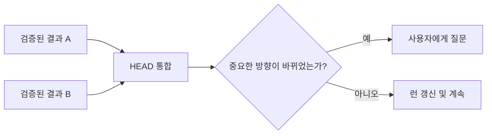

# 통합

[HEAD Agent Core (영문)](../../../README.md) / [학습 (영문)](../../../learn/README.md) / [운영](README.md) / 통합

## 학습 목표

작업자 연쇄가 아니라 HEAD가 검증된 로컬 결과를 전체 결과로 조합하는 이유를 이해합니다.

## 핵심 주장

통합은 검증된 결과를 작업 모델에 다시 연결합니다. HEAD는 의존성을 점검하고, 일반적인 슬라이스 간 선택을 해결하며, 정본에 기록된 현재 상태를 갱신하고, 다음 일관된 결과를 식별합니다.

## 설계 대응

HEAD는 모순, 누락된 의존성 또는 사용자 소유 결정을 감지할 수 있도록 넓은 컨텍스트를 유지합니다. 로컬 작업자 결과를 새 프로젝트 방향으로 조용히 바꾸지 않습니다. 작업이 오래 유지될 때 런 정본은 현재 위치와 정확한 다음 조치를 기록합니다.

## 관련 이론

이 분리는 실행면을 조정하는 제어면과 닮았습니다. 이는 회고적 설명 비유이지 원래 구현 의도에 관한 주장이 아닙니다.

## 흔한 오해

통합이 HEAD에게 검증된 로컬 작업을 다시 하도록 요구하지는 않습니다. 근거를 소비하고 조합 가능성을 시험하며, 근거가 부족하거나 더 큰 모델이 바뀔 때만 결과를 다시 엽니다.

## 요점

작업자는 경계가 정해진 결과를 만들고, HEAD는 그 결과들을 사용자의 전체 결과로 일관되게 만듭니다.

이전: [검증](verification.md) | 다음: [복구](recovery.md)

출처 분류: 현재 공유 원칙; 현재 공유 런타임 계약; 관련 이론.
