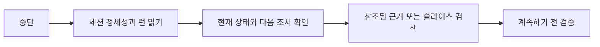

# 복구

[HEAD Agent Core (영문)](../../../README.md) / [학습 (영문)](../../../learn/README.md) / [운영](README.md) / 복구

## 학습 목표

손실이 있는 요약이나 최근 활동에 대한 추측이 아니라 정본 합의에서 오래 유지되는 작업을 재개합니다.

## 핵심 주장

중단 후 HEAD는 세션 정본에서 시작하고, 현재 결과를 다시 확립하며, 계속하는 데 필요한 참조 근거나 슬라이스를 검색합니다. 진행 기록은 이력을 찾는 데 도움이 될 수 있지만 합의를 대체하지는 않습니다.

## 설계 대응

런은 목적, 범위, 성공 조건, 결정, 현재 상황 및 정확한 다음 조치를 보존합니다. 뒷받침 근거는 영구적으로 로드하지 않고 참조된 채로 남습니다. 따라서 복구는 압축된 기억이 아니라 권위에서 작업 모델을 재구성합니다.

## 공개 참조

[세션 정본 참조 (영문)](../../../projects/context/session-canon.md)는 아키텍처 경계를 말합니다. [런타임 압축 계약 (영문)](../../../runtime/opencode/COMPACT_CONTRACT.md)은 고정 컨텍스트와 런이 생성된 요약보다 높은 권위를 유지함을 문서화합니다.

## 흔한 오해

정본은 검증의 완전한 대체물이 아닙니다. 재개한 작업은 여전히 변경 가능한 사실을 점검하고, 근거가 없거나 더 이상 적용되지 않는 이전 결과를 직접 검증해야 합니다.

## 요점

합의에서 재개하고, 합의가 참조하는 것을 검색하며, 계속하기 전에 근거를 다시 확립하세요.

이전: [통합](integration.md) | 다음: [엔드 투 엔드 예시](end-to-end-example.md)

출처 분류: 현재 공유 런타임 계약; 현재 공개 참조 계약.
