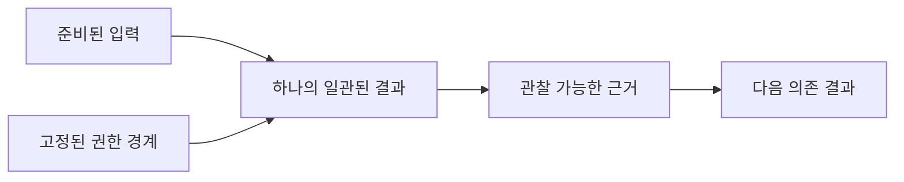

# 경계가 정해진 결과 구성

[HEAD Agent Core](../../README.md) / [학습](../README.md) / [운영](README.md) / 경계가 정해진 결과 구성

## 학습 목표

한 소유자가 더 큰 결과로 조합되는 독립적으로 관찰 가능한 결과를 만들 수 있도록 작업을 나눕니다.

## 핵심 주장

위임에 유용한 단위는 임의의 단계 묶음이 아니라 결과입니다. 좋은 슬라이스에는 준비된 입력, 명확한 경계, 로컬 실행을 위한 권한, 다른 소유자가 검사할 수 있는 근거가 있습니다.

## 설계 대응

독자적으로 설 수 있는 결과에서 나눕니다. 즉, 검토된 설계 결정, 작동하는 구현, 검증된 운영 점검입니다. 분리하면 지속적인 조정이 필요하거나 책임을 모호하게 만들 때는 결합된 변경을 한 소유자에게 유지합니다.

## 거부한 대안

단계 목록은 활동을 분배하지만, 전체 결과를 볼 수 없는 사람들 사이에 진단, 구현 및 검증을 나눌 수 있습니다. 다음 단계는 관찰된 산출물이 아니라 보고서를 소비하게 됩니다.

## 관련 이론

이는 경계가 정해진 컨텍스트, 단일 책임 및 최소 권한을 통해 이해할 수 있습니다. 이는 해석에 사용되는 관련 이론이지 역사적 증명은 아닙니다.

## 흔한 오해

경계가 정해진 것은 작다는 뜻이 아닙니다. 경계는 엔드 투 엔드 소유권에 필요한 만큼 크고, 그보다 크지 않아야 합니다.

## 요점

결과가 독립적으로 관찰 가능하고 조합 가능해지는 지점에서 나누세요.

이전: [컨텍스트 조합](composing-context.md) | 다음: [위임](delegation.md)

출처 분류: 현재 공유 원칙; 관련 이론.
