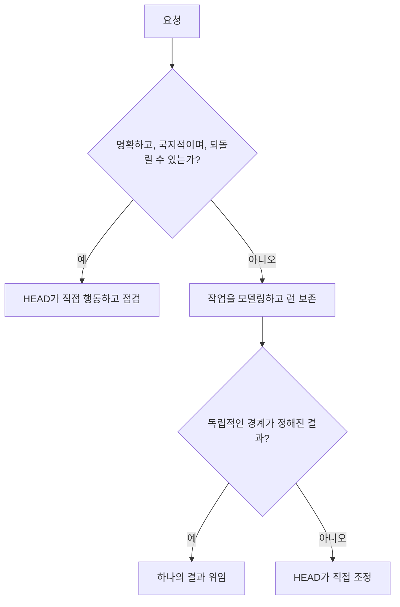

# 소규모 작업과 오래 유지되는 작업

[HEAD Agent Core (영문)](../../../README.md) / [학습 (영문)](../../../learn/README.md) / [운영](README.md) / 소규모 작업과 오래 유지되는 작업

## 학습 목표

모든 요청을 오래 유지되는 프로젝트로 만들지 않고 작업에 충분한 조정을 선택합니다.

## 핵심 주장

절차는 조정과 복구 필요에 맞춰 확장되어야 합니다. 명확하고 되돌릴 수 있는 요청은 직접 처리할 수 있지만, 여러 의존성, 중요한 결정, 인계 또는 중단 위험이 있는 작업에는 명시적 모델과 대개 런 정본이 필요합니다.

## 설계 대응

완료를 관찰 가능하게 만드는 가장 작은 형태를 사용합니다. 런은 작업이 중단을 견뎌야 할 때 오래 유지되는 합의를 기록하며, 위임은 소유자가 일관된 결과를 독립적으로 수행할 수 있을 때만 비용을 정당화하는 선택 사항입니다.

## 거부한 대안

일률적인 의식은 가르치기 쉽지만 실제로는 비효율적입니다. 한 줄 수정을 여러 당사자가 참여하는 릴리스처럼 다루면 지연을 만들고 실제 위험을 가립니다. 중요한 장기 작업을 채팅 답변처럼 다루면 결정과 복구 상태를 잃습니다.

## 흔한 오해

“소규모”는 중요하지 않다는 뜻이 아닙니다. 작지만 되돌릴 수 없거나 사용자 소유인 결정은 여전히 방향을 위한 멈춤이 필요할 수 있습니다. “오래 유지되는”은 위임되었다는 뜻이 아닙니다. HEAD는 직접 소유권을 유지할 수 있습니다.

## 요점

형식적인 절차를 수행하기 위해서가 아니라 실제 조정과 복구 필요를 보호하는 데 필요한 절차만 더하세요.

이전: [운영](README.md) | 다음: [작업 모델 만들기](building-the-work-model.md)

출처 분류: 현재 공유 원칙; 운영 관찰.
