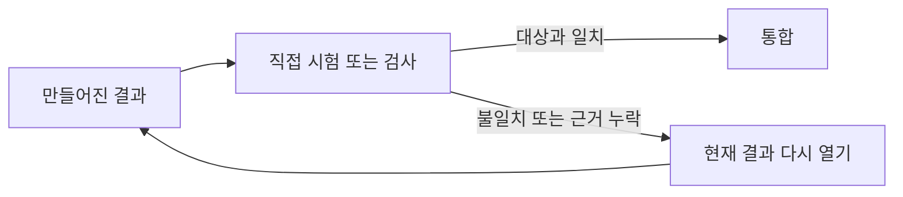

# 검증

[HEAD Agent Core (영문)](../../../README.md) / [학습 (영문)](../../../learn/README.md) / [운영](README.md) / 검증

## 학습 목표

결과가 이후 작업의 입력이 될 준비가 되었는지 결정하기 위해 직접적이고 관련 있는 근거를 사용합니다.

## 핵심 주장

확신 보고는 검증이 아닙니다. 하류 확장이 결과에 의존하기 전에, 합의한 관찰 가능한 행동, 산출물 또는 상태에 비추어 결과를 점검합니다.

## 설계 대응

결과를 구성할 때 완료 근거를 정의합니다. 소유자는 자체 점검하고, HEAD는 전체 작업 모델에 비추어 그 근거를 검증합니다. 별도 판단이 중요한 결과를 실질적으로 바꿀 수 있을 때 독립 검토자는 유용하며, 의례적으로 자동 추가하는 절차는 아닙니다.

## 거부한 대안

“완료”, 상태 갱신 또는 높은 확신 점수는 주장을 요약할 수 있지만 행동을 입증할 수는 없습니다. 점검하지 않은 결과를 하류로 전달하면 누락과 변경된 가정이 누적됩니다.

## 흔한 오해

검증은 하나의 자동화 시험과 동의어가 아닙니다. 적절한 직접 근거는 대상에 따라 렌더링된 인터페이스, 검토된 문서, 측정된 작업 또는 테스트 스위트일 수 있습니다.

## 요점

다음 단계로 확장되게 하기 전에 대상에 비추어 결과를 관찰하세요.

이전: [위임](delegation.md) | 다음: [통합](integration.md)

출처 분류: 현재 공유 원칙; 운영 관찰.
