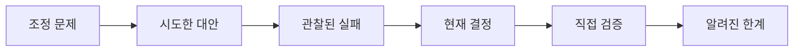

# 결정: 기각한 대안과 트레이드오프

[HEAD Agent Core](../../README.md) / [학습](../README.md) / 결정

## 학습 목표

HEAD Agent Core가 하나의 상주 결과 책임자, 경계가 정해진 일회성 워커, 결과 중심 위임, 통제된 컨텍스트, 오래 유지되는 런, 일반 원칙, 별도 검증을 유지하는 이유를 배웁니다.

## 핵심 주장

이 아키텍처는 기본값의 모음이 아닙니다. 현재의 각 선택은 대안에서 나타난 실패 양식에 대응한 것입니다. 선택에는 비용이 따르며, 그 비용도 계속 드러나 있습니다.

## 챕터 지도

1. [왜 하나의 에이전트가 아닌가?](why-not-one-agent.md)
2. [왜 자율적 군집이 아닌가?](why-not-an-autonomous-swarm.md)
3. [왜 워커는 일회성인가](why-workers-are-one-shot.md)
4. [왜 단계 목록이 아니라 결과인가?](why-outcomes-not-step-lists.md)
5. [왜 컨텍스트 덤프가 아니라 참조인가?](why-references-not-context-dumps.md)
6. [왜 런이며 런타임 상태가 아닌가?](why-runs-not-runtime-state.md)
7. [왜 금지 목록이 아니라 일반 원칙인가?](why-general-rules-not-deny-lists.md)
8. [왜 검증은 분리되는가](why-verification-is-separate.md)

## 이 챕터를 읽는 법

모든 결정 페이지는 같은 순서를 따릅니다. 문제, 시도한 대안, 관찰된 실패, 현재 결정, 관련 이론, 현재 한계입니다. 각각은 근거 유형도 표시합니다.

| 레이블 | 이 챕터에서의 용도 |
| --- | --- |
| 역사적 기록 | 보관된 설계 자료나 저장소 이력이 기록하는 내용. |
| 운영 관찰 | 보편 법칙이 아닌, 반복된 운영 양식. |
| 일반화된 실패 | 공개에 안전한 예시적 재구성. |
| 관련 이론 | 원래 의도에 대한 주장이 아닌, 사후적 설명 렌즈. |

## 범위

이 페이지들은 설계 근거를 설명합니다. 운영 지침, 비공개 예시, 내부 측정값, 프로젝트별 계약은 재현하지 않습니다. 현재 구현 세부 사항은 공개 [Shared Core](../../../head/README.md) (영문), [Skills](../../../skills/README.md) (영문), [Agents](../../../agents/README.md) (영문) 참조를 사용하세요.

이전 챕터: [운영](../08-operation/README.md) | 다음: [왜 하나의 에이전트가 아닌가?](why-not-one-agent.md)

출처 분류: 역사적 기록; 운영 관찰; 현재 공유 원칙; 사후적 이론.
