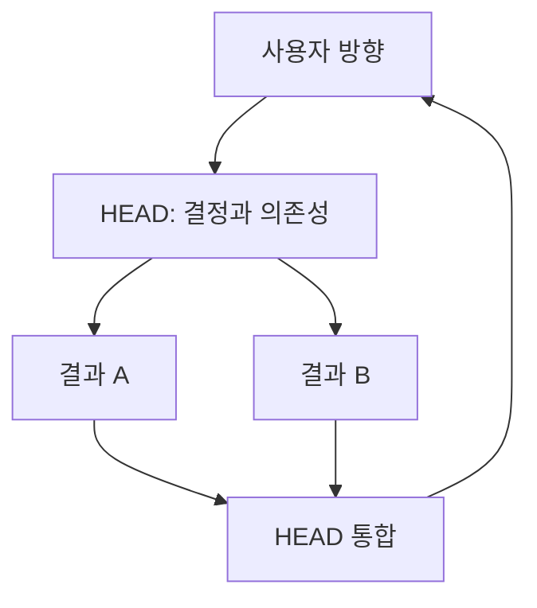

# 왜 자율적 군집이 아닌가?

[HEAD Agent Core](../../README.md) / [학습](../README.md) / [결정](README.md) / 왜 자율적 군집이 아닌가?

## 문제

병렬 작업은 경과 시간을 줄일 수 있지만, 호환되지 않는 가정도 늘릴 수 있습니다. 시스템에는 사용자 소유 결정을 서로 표류하는 별도 컨텍스트로 분산하지 않으면서 속도를 내는 방법이 필요합니다.

## 시도한 대안

많은 에이전트가 작업을 발견하고 서로에게 작업을 할당하며, 최소한의 중앙 판단으로 폭넓은 목표를 향해 조정하게 합니다. 명백한 매력은 자율성과 최대 병렬성입니다.

## 관찰된 실패

**역사적 기록.** 이전 아키텍처 자료는 전문 에이전트와 의존 단계, 그리고 명시된 입력을 사용할 수 있게 된 뒤의 병렬 작업을 모델링했습니다. 경계 없는 동료 간 조정이 신뢰할 수 있음을 확립하지는 않았습니다.

**운영 관찰.** 병렬성은 입력이 준비되고, 출력이 조합되며, 변경 표면이 충돌하지 않을 때에만 유용합니다. 더 많은 활성 에이전트가 미해결 결정을 해결하지는 않습니다. 그 결정에 대해 서로 호환되지 않는 여러 답을 만들 수 있습니다.

**일반화된 실패.** 세 에이전트가 온보딩 흐름을 개선하라는 폭넓은 요청을 받습니다. 각자는 성공을 다르게 해석하고 관련 표면을 바꿉니다. 보고는 모두 그럴듯하지만, 각자가 추측한 사용자 결정을 다시 열고 작업을 버리지 않으면 출력을 합칠 수 없습니다.

## 현재 결정

사용자는 동료 군집이 아니라 HEAD와 대화합니다. HEAD는 작업 모델을 만들고, 중요한 결정을 해결하거나 에스컬레이션하며, 준비된 입력을 갖춘 경계가 정해진 결과만 배정합니다. 독립된 결과는 함께 실행할 수 있고, 의존하거나 충돌하는 결과는 기다립니다. 워커는 근거로 프레이밍에 이의를 제기할 수 있지만 더 큰 목표를 조용히 재정의하지는 않습니다.

## 관련 이론

**관련 이론.** 방향성 비순환 그래프 스케줄링과 결정 권한 설계는 의존성과 권한이 명확해진 뒤에만 작업이 분기될 수 있는 이유를 설명합니다. 이는 사후적 이론이며, 형식적 스케줄러가 모든 위임의 안전성을 입증한다는 주장이 아닙니다.

## 현재 한계

HEAD는 병목이 될 수 있고 의존성 모델이 틀릴 수 있습니다. 어떤 작업은 실제로 탐색적이어서 조사 전에 완전히 명세할 수 없습니다. 이 경우 HEAD는 전체 미래를 안다고 가장하는 대신 워커에게 경계가 정해진 발견 결과를 줍니다.

## 요점

미해결 결정이 아니라 독립적으로 관찰 가능한 결과를 병렬화하세요. 하나의 결정 표면은 사용자 방향을 보존하면서 확장을 아래로 향하게 합니다.

이전: [왜 하나의 에이전트가 아닌가?](why-not-one-agent.md) | 다음: [왜 워커는 일회성인가](why-workers-are-one-shot.md)

출처 분류: 보관된 설계 자료의 역사적 기록; 운영 관찰; 현재 위임 원칙; 사후적 이론.
