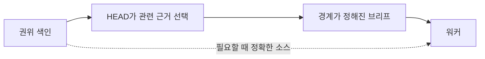

# 왜 컨텍스트 덤프가 아니라 참조인가?

[HEAD Agent Core](../../README.md) / [학습](../README.md) / [결정](README.md) / 왜 컨텍스트 덤프가 아니라 참조인가?

## 문제

소유자는 타당한 범위 내 결정을 내릴 만큼의 컨텍스트가 필요합니다. 가능한 모든 이력을 모든 소유자에게 주면 안전해 보이지만, 양이 권위, 관련성, 최신성을 가릴 수 있습니다.

## 시도한 대안

아무것도 빠뜨리지 않도록 넓은 프로젝트 배경, 이전 실패, 일반 프로세스 규칙, 주변 문서를 모든 워커 브리프에 복사합니다.

## 관찰된 실패

**역사적 기록.** 초기 설계 자료는 컨텍스트 한계와 집중된 입력에 대한 요구를 식별했습니다. 현재 공유 원칙은 넓은 지식을 색인화된 정본 소스에 두고 관련 부분집합만 조합하도록 소유자에게 지시합니다.

**운영 관찰.** 컨텍스트는 중립적인 저장소가 아닙니다. 무관하거나 충돌하는 자료는 현재 결정에서 주의를 빼앗고, 복사된 발췌문은 오래되어 권위 소스와의 관계를 잃습니다.

**일반화된 실패.** 워커가 오래된 대안, 무관한 제약, 현재 요구사항이 담긴 긴 패킷을 받습니다. 현재 소스가 다르게 말하는데도 구체적이고 가까이에 있다는 이유로 폐기된 예시를 따릅니다.

## 현재 결정

워커에게 가장 작은 완전한 컨텍스트, 즉 결과, 고정된 결정, 권위 있는 시작 입력, 경계, 완료 근거를 줍니다. 워커가 정확한 소스를 안전하게 검사할 수 있으면 폭넓은 이력과 정본 소스는 복제하지 말고 참조합니다. HEAD는 근거를 선택하고 해석하는 데 필요한 더 넓은 컨텍스트를 보유합니다.

## 관련 이론

**관련 이론.** 정보 검색, 경계가 정해진 컨텍스트, 최소 정보 원칙은 이 선택을 설명합니다. 이 렌즈들은 보편적인 최소 컨텍스트 크기를 뜻하지 않습니다. 충분성은 내리는 결정에 달려 있습니다.

## 현재 한계

참조는 접근할 수 없거나, 오해되거나, 검사 비용이 너무 클 수 있습니다. 과도한 가지치기는 덤프가 산만함을 만드는 것만큼이나 발명을 강요할 수 있습니다. HEAD는 경계가 정해진 결과에 무엇이 충분히 완전한지 판단하고, 근거가 공백을 드러내면 그 판단을 수정해야 합니다.

## 요점

이력 아카이브가 아니라 결정을 바꾸는 컨텍스트를 보내세요. 참조로 권위를 보존하고, 추측 없이 소유자가 성공할 수 있는 가장 작은 집합을 선택하세요.

이전: [왜 단계 목록이 아니라 결과인가?](why-outcomes-not-step-lists.md) | 다음: [왜 런이며 런타임 상태가 아닌가?](why-runs-not-runtime-state.md)

출처 분류: 역사적 기록; 운영 관찰; 현재 공유 컨텍스트 원칙; 사후적 이론.
