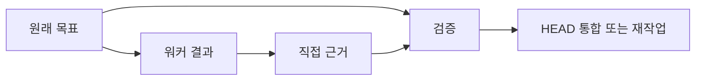

# 왜 검증은 분리되는가

[HEAD Agent Core](../../../README.md) (영문) / [Learn](../../../learn/README.md) (영문) / [결정](README.md) / 왜 검증은 분리되는가

## 문제

완료한 행동이 반드시 올바른 결과는 아닙니다. 시스템에는 그 출력이 더 많은 작업의 입력이 되기 전에 의도한 결과와 비교할 방법이 필요합니다.

## 시도한 대안

워커의 보고, 통과한 로컬 검사 또는 생산자의 확신을 완료로 받아들입니다. 더 강한 형태에서는 같은 소유자가 실행하고 독립된 반박 없이 최종 성공을 선언합니다.

## 관찰된 실패

**역사적 기록.** 보관된 설계 자료는 다단계 작업 뒤 별도 검증을 요구했습니다. 현재 아키텍처는 실행에 직접 결과 근거를 두고, 독립된 판단이 중요한 결과를 실질적으로 바꿀 수 있는 경우에만 독립 검토를 둡니다.

**운영 관찰.** 생산자는 자신이 무엇을 시도했는지 자연스럽게 알기 때문에 실제 동작보다 수행한 활동을 검증하기 쉬울 수 있습니다. 보고는 유용한 근거일 수 있지만 전체 결과의 진실 소스로 조용히 격상되어서는 안 됩니다.

**일반화된 실패.** 워커가 요청된 모든 파일을 바꾸었고 로컬 검사가 통과했다고 보고합니다. 이후 통합에서 바뀐 동작이 고정된 인터페이스 결정을 위반했음이 드러납니다. 행동 근거는 실제였지만 결과 근거는 불완전했습니다.

## 현재 결정

각 경계가 정해진 결과에 직접 근거를 넣고, HEAD가 이를 원래 목표에 비춰 검증하여 더 큰 작업 모델에 통합합니다. 영향의 중대성, 불확실성 또는 새로움이 두 번째 판단을 정당화하면 독립 검토자를 추가합니다. HEAD가 직접 수행할 때에도 검증은 책임상 분리됩니다.

## 관련 이론

**관련 이론.** 직무 분리, 테스트 오라클 사고, 피드백 제어는 관찰된 결과를 추가 확장 전에 목표와 비교해야 하는 이유를 설명합니다. 이 이론들은 사후적이며 어떤 단일 검사도 충분하다는 뜻은 아닙니다.

## 현재 한계

검증은 약하거나 비싸거나 잘못된 오라클에 기초할 수 있습니다. 독립 검토는 같은 오해를 되풀이하거나 가치 없이 지연을 더할 수 있습니다. 그러므로 시스템은 모든 작업을 똑같이 위험하다고 취급하는 대신 검토가 결과를 실질적으로 바꿀 수 있는지 묻습니다.

## 요점

실행 근거는 자동 완료가 아니라 판단의 입력으로 취급하세요. 결과를 이후에 신뢰하기 전에 합의된 목표에 비춰 검증하세요.

이전: [왜 거부 목록이 아니라 일반 원칙인가?](why-general-rules-not-deny-lists.md) | 다음 챕터: [진화](../10-evolution/README.md)

출처 분류: 보관된 검증 설계의 역사적 기록; 운영 관찰; 현재 완료 원칙; 사후적 이론.
