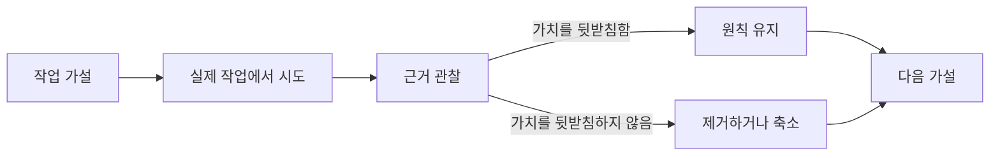

# 진화: 근거가 무엇을 바꾸었는가

[HEAD Agent Core](../../README.md) / [학습](../README.md) / 진화

## 학습 목표

AI 작업 시스템을 발견되기를 기다리는 완성된 아키텍처가 아니라 수정 가능한 가설들의 집합으로 다루는 법을 배웁니다.

## 핵심 주장

현재 설계는 근거와 접촉한 뒤 살아남은 제약의 기록입니다. 이전 버전은 이해할 만한 이유로 역할, 도구, 컨텍스트, 형식 규칙, 복구 장치를 추가했습니다. 뒤이은 근거는 그러한 추가가 어디에서 약속한 가치를 내지 못했거나 새 실패 양식을 만들었는지 보여 주었습니다.

이는 장치가 적을수록 항상 낫다는 주장이 아닙니다. 모든 계층은 계속해서 자신의 조정, 컨텍스트, 유지보수 비용을 감당할 가치를 보여야 한다는 주장입니다.

## 챕터 지도

1. [타임라인](timeline.md)
2. [기각한 가설](hypotheses-we-rejected.md)
3. [테스트를 통과해 남은 것](what-survived-testing.md)
4. [복잡성 이후의 단순화](simplification-after-complexity.md)
5. [근거의 경계](evidence-boundaries.md)

## 이 챕터를 읽는 법

각 페이지는 주장을 출처 분류로 표시합니다. **역사적 기록**은 저장소 이력이나 보관된 설계 자료의 근거를 식별합니다. **운영 관찰**은 시스템을 실행하며 본 경계가 정해진 관찰을 말합니다. **일반화된 실패**는 비공개 운영 세부 사항 없이 실패를 다시 말합니다. **관련 이론**은 사후의 설명 렌즈이지, 구축자가 원래 무엇을 의도했는지에 관한 주장이 아닙니다.

## 요점

아키텍처는 우아한 기원 이야기가 있을 때가 아니라 반대 근거 뒤에 눈에 보이게 바뀔 때 신뢰할 수 있게 됩니다.

이전: [결정](../09-decisions/README.md) | 다음: [타임라인](timeline.md) | 챕터 나가기: [도입](../11-adoption/README.md)

출처 분류: 역사적 기록; 운영 관찰; 일반화된 실패; 관련 이론.
