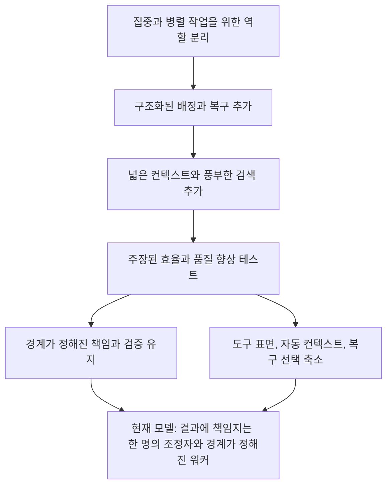

# 타임라인

[HEAD Agent Core](../../../README.md) (영문) / [Learn](../../../learn/README.md) (영문) / [진화](README.md) / 타임라인

## 핵심 주장

시스템은 단순한 상태에서 올바른 상태로 직선 이동하지 않았습니다. 지역 문제를 해결하려고 구조를 반복해 추가했고, 근거가 진단을 바꾸면 구조를 제거하거나 축소했습니다.

## 초기 분리

**역사적 기록.** 초기 아키텍처는 집중된 컨텍스트, 구별되는 전문성, 병렬 작업을 목적으로 작업을 여러 전문 역할에 나누었습니다. 같은 기록은 의존 결과를 통합하는 조정자 역할도 보존했습니다.

이는 합리적인 시작 가설이었습니다. 하나의 긴 대화가 관심사를 섞는다면, 전문 소유자에게 관심사를 분배하면 명료성이 나아질 수 있습니다. 이는 각 관심사에 오래 유지되는 에이전트가 필요하거나 더 많은 동시 역할이 결과를 개선한다는 근거는 아니었습니다.

## 구조화된 장치

**역사적 기록.** 이후 저장소 이력은 구조화된 배정, 명시적 작업 상태, 자동 복구 지침, 점점 상세해지는 컨텍스트 주입에 투자했음을 보입니다. 이 조치들은 관찰된 명령 전달 실패, 긴 컨텍스트 중단, 워커 지시의 모호성에 대응했습니다.

**일반화된 실패.** 시스템은 더 많은 상태를 기록하고 다시 찾을 방법을 더해 취약한 인계를 고칠 수 있습니다. 각각은 따로 보면 보호적으로 보입니다. 함께 놓이면 여러 기록이 서로 다를 수 있고 하나를 고르는 일이 검증되지 않은 결정이 되어 복구 경로를 추론하기 어려워집니다.

## 효율 주장과 관찰의 만남

**운영 관찰.** 비교 작업은 그래프 형태의 검색 계층이 코드 조사에 일반적으로 토큰을 절약한다는 주장을 흔들었습니다. 관찰된 사례에서 직접 검색은 제안된 검색 오버헤드 없이 관련 코드에 닿을 수 있었습니다. 남은 가치는 더 좁았습니다. 당장의 코드 표면 밖에 있는 근거에 질문을 연결하고, 그 근거가 필요할 때 권위 있는 현재 상태에 결론을 대조하는 것이었습니다.

이것은 교훈을 “먼저 그래프를 사용하라”에서 “결정을 바꾸는 근거를 검색하라”로 바꾸었습니다.

## 설계 결과로서의 단순화

**역사적 기록.** 이후 Shared Core 변경은 규칙이 많은 지침을 압축된 원칙으로, 규정적인 계획 형식을 작업에 맞는 구조를 허용하는 안정적인 작업 합의로 바꾸었습니다. 현재 복구 문서도 포인터, 스냅샷, 대체 수단 중 복구 시 선택하는 대신 작고 고정된 권위 집합을 정의합니다.

결과는 하나의 구분되지 않은 대화로 되돌아간 것이 아닙니다. 결과에 책임지는 한 명의 조정자, 명시적 작업 모델, 경계가 정해진 결과 책임, 직접 검증, 중요한 작업을 위한 오래 유지되는 합의는 남겼습니다.

## 사후적 렌즈

**관련 이론.** 이 이력은 반복적 시스템 설계를 닮았습니다. 가설을 명시하고, 사용 중에 시험하며, 관찰된 동작이 예상 이점과 모순되면 수정합니다. 이 이론은 양식을 설명할 뿐, 역사적 구축자가 이 이론에서 시작했다는 근거는 아닙니다.

## 요점

폐기된 장치 뒤에 있던 문제 해결 의도를 유지하세요. 장치가 사라져도 더 작은 규칙으로 남을 수 있습니다.

이전: [진화 개요](README.md) | 다음: [기각한 가설](hypotheses-we-rejected.md) | 챕터 나가기: [도입](../11-adoption/README.md)

출처 분류: 역사적 기록; 운영 관찰; 일반화된 실패; 관련 이론.
