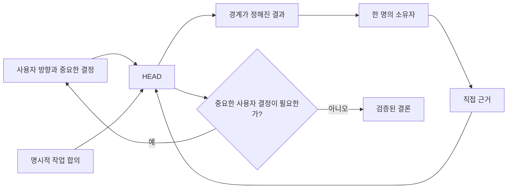

# 테스트를 통과해 남은 것

[HEAD Agent Core](../../README.md) / [학습](../README.md) / [진화](README.md) / 테스트를 통과해 남은 것

## 핵심 주장

단순화는 행동을 관찰 가능한 근거와 명확한 책임에 계속 연결하는 통제를 남겼습니다. 주로 장치만 늘리는 기본값은 제거했습니다.

## 코드 외부 근거

**운영 관찰.** 중요한 질문 중 일부는 구현 표면만으로 해결할 수 없습니다. 남은 규칙은 “언제나 더 많은 데이터를 모아라”가 아닙니다. 그 근거가 결론을 바꿀 수 있을 때 당장의 코드 표면 밖에 있는 권위 있는 근거를 검색하고, 이를 검증되지 않은 가설과 구별하라는 것입니다.

## 행동 규칙

**역사적 기록.** Shared Core 개정은 누적된 금지와 상세 절차를 줄이면서도 의도적 컨텍스트, 명시적 작업 모델, 점진적 구체화, 응집된 책임, 정본, 결정 소유권, 직접적인 신뢰 형성 근거에 관한 원칙은 보존했습니다.

**관련 이론.** 이는 불변 조건 기반 설계를 닮았습니다. 모든 역사적 예외를 열거하는 대신 새 상황을 이끌 수 있는 작은 행동 제약 집합을 보존합니다. 이 비유는 사후적입니다.

## 명시적 컨텍스트 포인터

**역사적 기록.** 현재 아키텍처는 넓은 프로젝트 지식을 활성 컨텍스트 밖에 두고 참조를 사용해 관련 정본 소스를 검색합니다. 또한 오래 유지되는 작업의 권위와 변경 가능한 인계 기록을 구별합니다.

**운영 관찰.** 포인터는 소유자가 모든 문서를 활성 지시로 취급하지 않고 권위 있는 세부 사항을 복구하게 할 때 유용합니다.

## 경계가 정해진 책임

**역사적 기록.** 초기 및 현재 자료 모두 작업에 결과를 책임지는 소유자가 있어야 하며 의존 결과에는 통합이 필요하다는 생각을 보존합니다. 살아남은 버전은 이를 영구적 전문 계층이 아니라 응집된 결과로 좁힙니다.

**운영 관찰.** 한 소유자는 좁게 분할된 작업의 연쇄보다 적은 인계 가정으로 경계가 정해진 결과를 진단하고 행동하며 직접 근거를 낼 수 있습니다.

## 직접 검증

**일반화된 실패.** 검토는 원래 결과가 여전히 불완전한데도 축소된 작업 재진술에 대해 통과할 수 있습니다. 보고에 대한 확신은 요청된 결과가 존재한다는 근거가 아닙니다.

**역사적 기록이 뒷받침하는 현재 대응.** 검증은 관찰 가능한 결과와 관련 1차 근거를 확인한 뒤 결과가 이후 작업의 기반이 되게 하는 별도 단계로 유지됩니다.

## 사용자 결정 게이트

**역사적 기록.** 현재 원칙은 중요한 결정의 권한을 사용자에게 유지하고, 일반 계획 및 실행 결정은 조정자에게 배정합니다.

**관련 이론.** 이는 결정 권한 설계에 대응합니다. 결정 권한은 그 결과를 책임지는 당사자에게 있어야 합니다. 이는 설명 렌즈이지 원래 설계 방법에 관한 역사적 주장이 아닙니다.

## 요점

유지할 만한 통제는 권위를 보존하고, 작업을 검사 가능하게 하며, 의도한 결과가 실제로 일어났는지 드러내는 통제입니다.

이전: [기각한 가설](hypotheses-we-rejected.md) | 다음: [복잡성 이후의 단순화](simplification-after-complexity.md) | 챕터 나가기: [도입](../11-adoption/README.md)

출처 분류: 역사적 기록; 운영 관찰; 일반화된 실패; 관련 이론.
